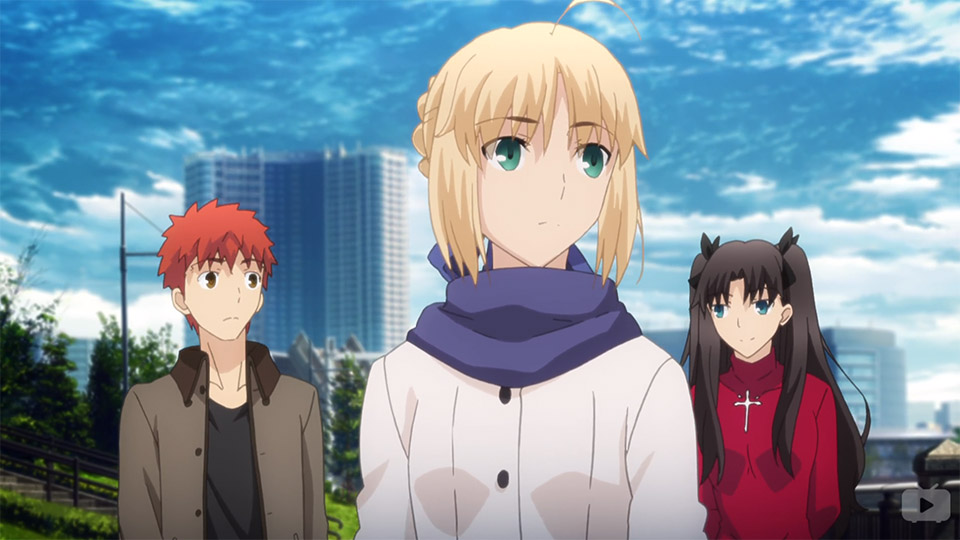
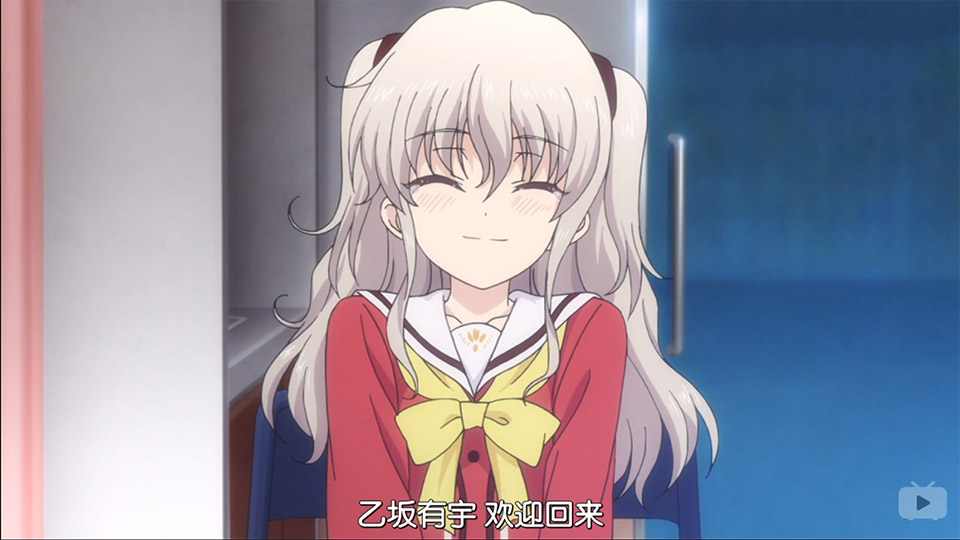
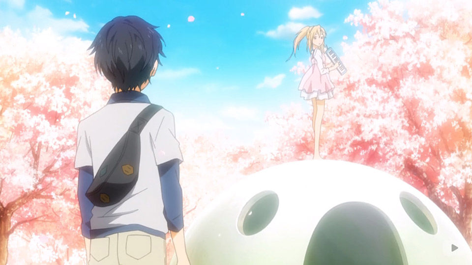
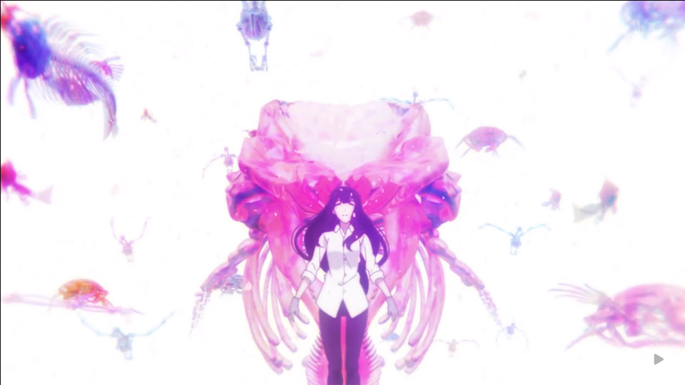
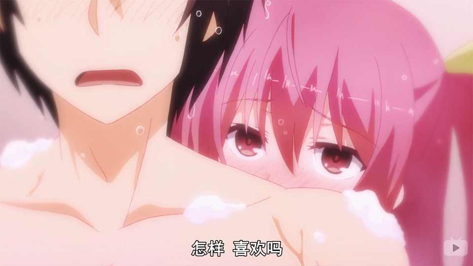
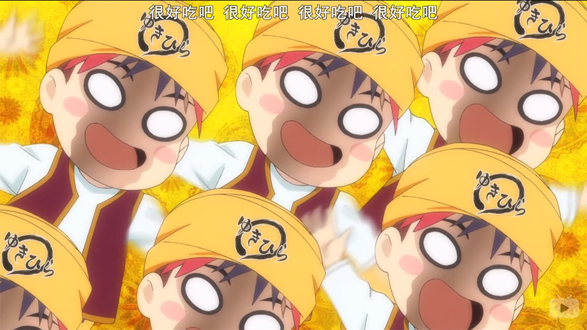
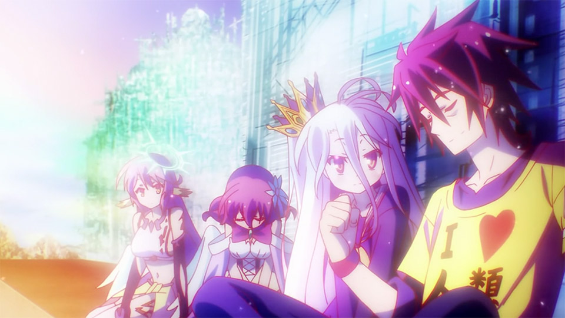
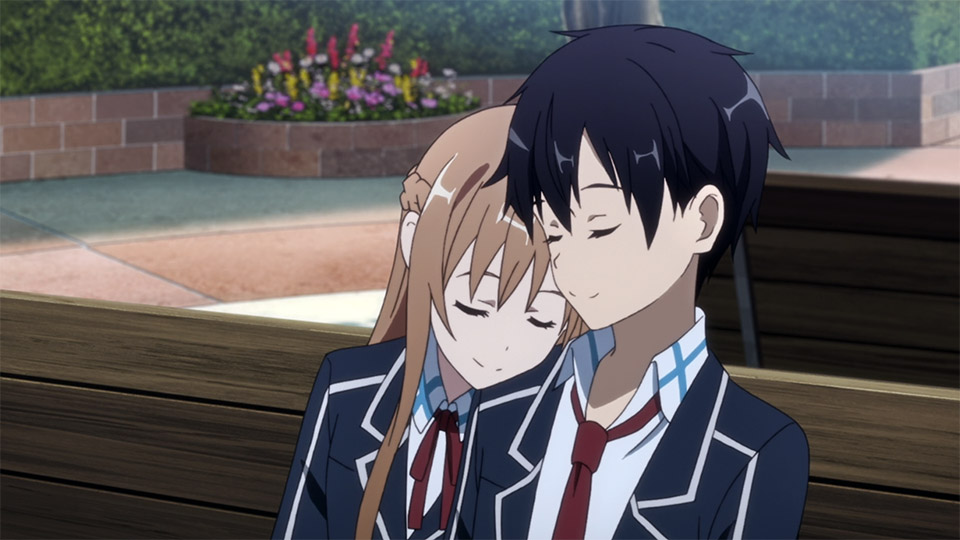

 四月是你的谎言
        补番推荐：(4.5/5) 刀剑神域1/2
    keywords:    动漫, 番剧, 评价, bangumi, review, ACG
    date:        2015-12-31
~)

2015补番日志
===

<strong style="display:block; text-align:center; color:lightgreen;">本文不含剧透，请放心食用。</strong>

## ~~Saber今晚留下来~~：无限剑制 / Fate/Stay Night UBW
* 奇幻
* 伪后宫
* 重制

|     |      |                                       |
|-----|------|---------------------------------------|
| 画风 |**5+**| 经费已爆炸；全程加特技；无可挑剔的细节      |    
| 音乐 |**4** | OP/ED非常赞，但是场景配乐没有留下什么印象   |
| 剧情 |**4** | 遵循了原作UBW线True End                 |
| 人设 |**5** | 呆萌款Saber＋教科书式般傲娇的凛           |
| 设定 |**4** | 遵循原作设定                            |
**4.5** / 5  --  对06年Fate/TE和游戏画质的怨念可以退散了

10月OVA为HE结局，强烈推荐。（什么！你不想要Saber？）另外，按照制作组说法，HF（樱）线已决定剧场化。作为没有推过原作HF线的玩家，表示十分期待（~~愉♂悦~~）。相关动漫包括前传Fate/Zero、06年Fate线Fate/Stay Night。另有手游Fate/Grand Order。日区现已上市，国区要有生之年。

Fate和UBW线都讲*情侣面对困境*，对圣杯战争深层的东西没有探究。场景细节非常棒。1080p下可以截屏当壁纸。（~~Retina屏依旧马赛克~~）

## 干物妹！小埋 / U.M.R
* 日常
* 治愈
* 萌萌哒

|     |      |                             |
|-----|------|-----------------------------|
| 画风 |**3** | 中规中矩的日系画风             |    
| 音乐 |**4** | 日常配乐，没有什么特别的地方    |
| 剧情 |**3** | 日常                        |
| 人设 |**5** | 均为萌系设定＋小埋自动变身     |
| 设定 |  -   | 不适用                      |  
**4+** / 5  --  来看暖系治愈吧！

萌系日常番。虐系治愈看多了试试萌系治愈也不错啊！~~麻麻我也想养一只小埋！！！~~ 感觉大埋的建模和Asuna惊人相似。~~欧尼酱（哥哥）的程序员设定似乎很满足了广大死宅想有一个好养的可爱妹妹的愿望。~~

## 夏洛特 / Charlotte
* 治愈
* 科幻
* 超能力
* 真爱

|     |      |                                       |
|-----|------|---------------------------------------|
| 画风 |**4** | 整体画风精细，但没有什么特别出彩的地方                |    
| 音乐 |**5+**| K社就是为了卖！专！辑！                             |
| 剧情 |**3** | 前期铺垫足够多，后期推进太突然（~~大魔王：经费不够了~~） |
| 人设 |**4** | 没有特别出彩的地方。哥哥（隼）人设好评                 |
| 设定 |**4** | 科幻。彗星Charlotte（~~哈雷~~）引发超能力＋类时空穿越 |
**4.3** / 5 -- 难得的佳作

出自K社与大魔王之手。剧情虽带治愈属性，但不如10年的Angel Beats。（~~都怪经费~~）个人认为此番应该按两季制作。压缩为一季导致后期（EP11-12）剧情发展过快，第一次看的时候难以完全理解剧情内容，严重影响整体质量。音乐延续K社卖唱片风格。专辑《ECHO》与《Smells Like Tea,Espresso》非常惊艳（和AB的Girls Dead Monster系列如出一辙）。marina大大（~~灵魂歌手~~、~~AB岩泽转世~~）的声线好顶赞。柚咲（CV内田真礼）的曲目非常燃。

与《四月》同属治愈番。但可能是因为10-12话剧情推进太快，导致我个人对《夏洛特》的治愈属性没有太大感觉，就这一点来说似乎有点败K社口碑。

## **四月是你的谎言 / Your lie in April**
* 治愈
* 真爱
* 人生
* 日常

|     |      |                                        |
|-----|------|----------------------------------------|
| 画风 |**4** | 主角相关细节非常精细，但次要场景稍简陋       |    
| 音乐 |**5** | 钢琴乐可收藏；剧情配乐十分应(cui)景(lei)    |
| 剧情 |**5+**| 生活、写实；极强治愈效果；就抒情而言，无可挑剔 |
| 人设 |**5** | 女主人设太赞，对治愈系女主没什么防备         |
| 设定 |**4** | 除年龄为初中外，没什么问题                 |
**4.8** / 5  --  此生无悔入二次元

本命番。一部好的番剧并不需要花哨的架空设定，讲述现实故事就好了。与《CLANNAD》、《花名未闻》同样为写实系，感染力/代入感极强。如果说年少时的爱恋永远都是番剧极佳的主题，那么《四月》便是将这段爱恋的情感表达到了极致。这场以谎言开始的短暂爱恋，使两人的生命合二为一。女主用超越现实的陪伴完成了15年动漫中最深情的告白。当知道结局，回看第二遍的时候，全篇散发着温暖的感觉。

除了女主绚丽温暖的爱恋，番剧也很好表现了男主青梅竹马（女二）的*略带苦涩的爱恋*。除了主线外，支线也有不少值得回味的地方（女二、友情、亲情）。虽然剧情时间跨度较短、人物普适度（性格、经历）不如CL，但带来了不亚于CL的感动。

以古典乐作为配乐，并出色地配合情感宣泄，这在番剧中是很少见的。OP/ED的制作非常出色。

另有OVA：MOMENTS，讲述了公生、绘见、武士小时候的故事。

完整版（含剧透）：[四月是最深情的告白](../your-love-in-april/)

## 樱子小姐的脚下埋着尸体
* 悬疑
* 推理

|     |      |                                       |
|-----|------|---------------------------------------|
| 画风 |**4** | 整体中规中矩，樱子小姐变身过场真酷炫        |    
| 音乐 |**2** | 似乎没什么印象，OP/ED也不合我的口味        |
| 剧情 |**4** | 本季剧情中偏下，但第二季值得期待           |
| 人设 |**3** | 男主的设定似乎有些多余？就目前看：意味不明   |
| 设定 |**5** | 后续剧情可以拓展，值得期待                |
**3.6** / 5  --  或许第二季更精彩

10月新番。自[死神小学生](http://zh.moegirl.org/名侦探柯南)后又一部"去哪哪有案件"的悬疑推理动漫。男主女主之间的关系似乎有点狗血/无厘头的成分，至少以我的智商无法理解（~~莫非要演变成姐弟恋？！~~）.

但目测第二季是[有生之年系列](http://zh.moegirl.org/有生之年)。

## 落第骑士英雄谭
* 奇幻
* 后宫

|     |      |                                       |
|-----|------|---------------------------------------|
| 画风 |**4** | 画风不错，细节表现到位                   |    
| 音乐 |**2** | 配乐、OP/ED都没有留下什么印象            |
| 剧情 |**3** | 后宫线；男主向世界证明自己                |
| 人设 |**3** | 人设中规中矩                            |
| 设定 |**5+**| 番剧的内容仅仅是世界的冰山一角，有很大发展空间 |
**4** / 5  --  或许第二季更精彩

10月新番。感觉剧情没有什么出彩之处。虽然是后宫系，但男主女主扔散发出~~恋爱的酸臭味~~。个人认为此番剧世界观与[魔禁/超炮](https://zh.wikipedia.org/wiki/魔法禁書目錄)有相似之处。在剧情外还有一个庞大、神秘的组织操控着世界。就这一点来说，扩展性很强，后续应该能发展出精彩的故事。虽然其他方面表现不够好，但总评依旧为4分。

但目测第二季是[有生之年系列](http://zh.moegirl.org/有生之年)。

## 食戟之灵 （~~春药之灵~~）
* 美食
* 后宫
* 热血

|     |      |                                        |
|-----|------|----------------------------------------|
| 画风 |**4** | 与众不同的游戏风格奇幻色调                 |    
| 音乐 |**3** | 中规中矩的配乐/音乐                      |
| 剧情 |**5** | 整部番看下来很爽快，似乎很能让人上瘾的样子   |
| 人设 |**4** | 人设有可圈可点之处                       |
| 设定 |**5** | 虽然设定有些无厘头，但是很能让人上瘾的样子   |
**4.2** / 5 麻麻我要看第二季！

小当家之后又一部高能美食类番剧。世界观设定似乎有些中二。角色各有特点，傲娇女王的设定不能更赞。男主的厨(chun)艺(yao)会引起食客的谜(jiao)样(chuan)反应。观看时建议全程耳机，避免剧中高能反应扩散。

## 游戏人生 / No Game No Life
* 智商
* 奇幻
* 后宫

|     |      |                                        |
|-----|------|----------------------------------------|
| 画风 |**5** | 与众不同的游戏风格奇幻色调                 |    
| 音乐 |**2** | 对配乐没什么印象                         |
| 剧情 |**5** | 就智商/策略系而言相当不错                 |
| 人设 |**4** | 废宅×2；后宫实力强大                     |
| 设定 |**5** | 如果人生是可以按照既定规则通关的游戏该多好啊 |
**4.1** / 5  --  感觉智商有点不够用、期待第二季

如果人生的一切都可以按照游戏规则来攻略，那岂不是非常赞。当空(Sora)、白(Shiro)这对~~废宅~~兄妹二人组进入这样的世界后，从最弱的人类开始，攻略其他15个种族，最后与世界之神挑战的故事（然而第一季只攻略了一个种族……）。番剧看点在于空白如何用游戏设定逆转局势战胜对手，废宅级的游戏功力果然可怕。

第一季往后的剧情应该非常有趣，但是按照漫画的设定似乎就开始变成纯后宫番了（~~男主的智商消失了~~）。因此目测第二季是[有生之年系列](http://zh.moegirl.org/有生之年)。

## **刀剑神域 / Sword Art Online**
* 科幻
* 真爱
* 伪后宫
* 虚拟世界

|     |      |                                        |
|-----|------|----------------------------------------|
| 画风 |**3** | 中规中矩，没有特别出彩的地方               |    
| 音乐 |**3** | 燃系OP/ED                              |
| 剧情 |**4** | 仔细想一下会发现剧情藏了一些有趣的东西      |
| 人设 |**5+**| Asuna人气女主＋技术宅男主，宅男梦想啊！     |
| 设定 |**5+**| 或许不久将来，SAO的世界会成为现实          |
**4.7** / 5  --  技术宅的胜利！期待第三季

SAO最有趣的地方在于故事设定是可企及的未来（没有架空设定），当虚拟与现实难以区分时会发生什么呢？VR又能带来什么？SAO以此衍生出了一系列故事。表面看可能战斗型一时爽，但仔细想一下还是可以发现有趣的东西。

桐人作为骨灰级玩家，通关游戏（VR世界）、收获真爱（第一季）、~~收集伪后宫（第二季）~~、用技术改变世界的设定对技术宅有不可抗拒的吸引力。

-----

## OST推荐
包括番剧OST、衍生专辑曲目

|     番剧      | Artist | Title                     |
|--------------|--------|---------------------------|
| FSN [UBW]    | Aimer    |  Brave Shine            |
| FSN [UBW]    | Kalafina | Ring Your Bell          |
| Charlotte    | marina | Blood Colour              |
| Charlotte    | marina | Falling                   |
| Charlotte    | marina | Let's feel good           |
| Charlotte    | How-Low-Hello | Real               |
| Charlotte    | How-Low-Hello | Hand with Blood    |
| Charlotte    | How-Low-Hello | 楽園まで / 直到乐园   |
| Charlotte    | How-Low-Hello | 発熱デイズ / 发热时光 |
| Charlotte    | How-Low-Hello | Not be found       |
| Charlotte    | 熊木杏里       | 君の文字             |
| 四月是你的谎言 | Goose House | 光るなら                 |
| 四月是你的谎言 | 7!!         | オレンジ（Acoustic Ver.） |
| 四月是你的谎言 | wacci       | キラメキ                 |
| 刀剑神域      | Lisa        | Corssing Field    |
| 刀剑神域      | 藍井エイル    | INNOCENCE         |
| 刀剑神域      | 春奈るな     | Overfly            |
