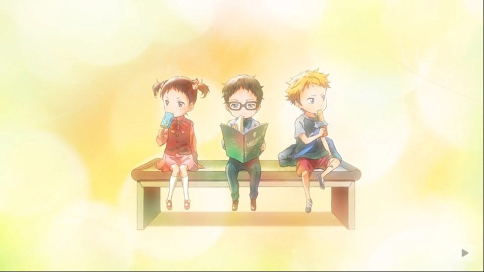
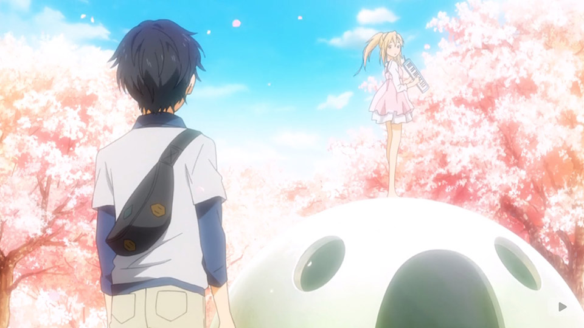
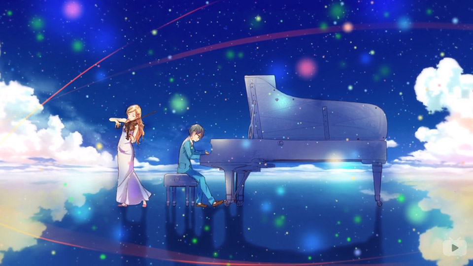
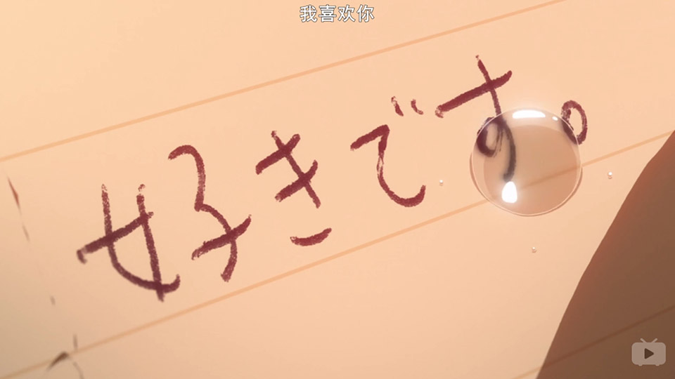
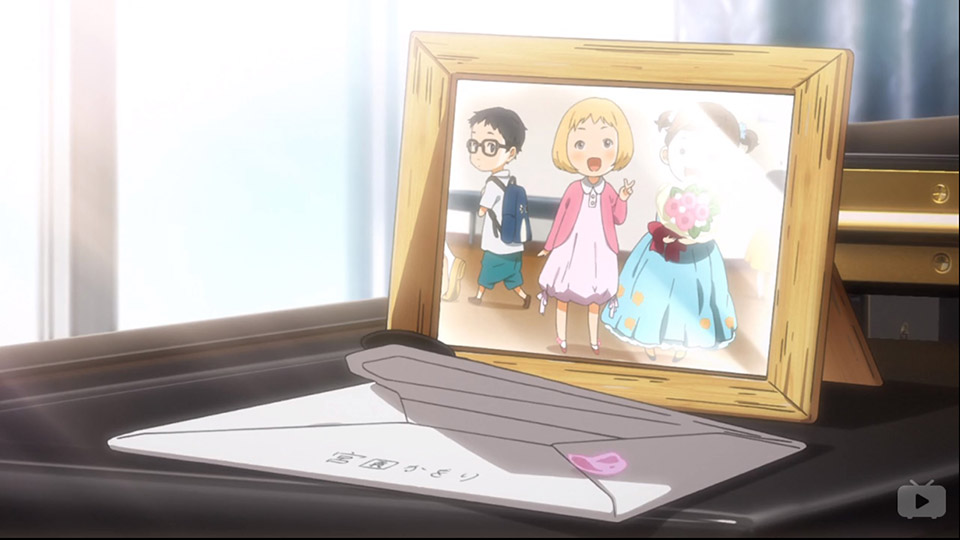
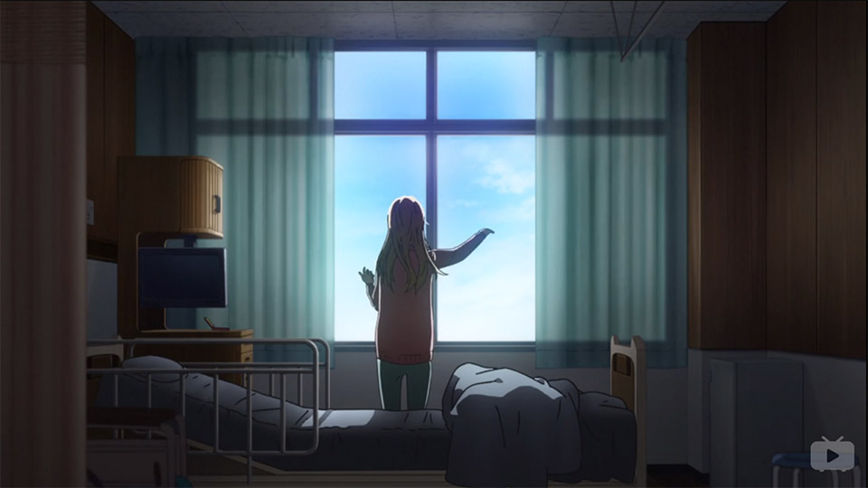
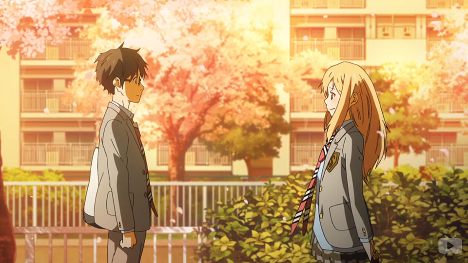

四月是你最深情的告白
===
## 四月は君の嘘 / 四月是你的谎言

## tl;dr
前半段比较正常的校园剧情：女主与废柴男主的日常。介绍男主心理状态等。女主勾搭男主；  
后半段治愈（致郁）向：女主治愈男主，女主因病离世。男主成长，和小伙伴们一起走上人生的旅途。

个人评价： **4.8** / 5  --  此生无悔入二次元

| Type| Rate |                                      |
|-----|------|--------------------------------------|
| 画风 |**4** | 主角相关细节非常精细，但次要场景稍简陋     |    
| 音乐 |**4** | 钢琴乐可收藏。日系钢琴曲风               |
| 剧情 |**5+**| 生活、写实；极强治愈效果                 |
| 人设 |**5** | 主角人设5+，配角人设4                   |
| 设定 |**4** | 除年龄为初中外，没什么问题。生活向         |

<strong style="display:block; text-align:center; color:red;">下文包含剧透内容！</strong>

## EP19 再见了英雄

剧情收束，武士在预选赛中完成演奏，与心中公生的映像告别，继续走上演奏者的道路。就像小时候第一次听公生演奏后那样，执着、倔强、不服输。这里收束了前段武士、绘见以公生为目标不断超越自己的故事线。对于青春期的少年来说，最好的鼓励便是竞争对手。

这里表现对年少时的玩伴、对手的感谢。

## EP22 春风 Harukaze / True End

每年春风吹过的时候，公生都会想起樱花树下的那个少女吧。

#### 一个人的合奏

公生在台上演奏时脑补了薰与自己合奏的情景。

如公生所说：自己并不善于说辞。他用琴声讲述这个幸福而悲伤的故事。最后，薰化作一道光消失，公生用琴声向喜欢的女孩与这两年禁锢的时光道别。薰让公生开始坦诚面对音乐，他不是母亲的牵线木偶，而是一个有血有肉的，是自由的演奏者。薰让公生灰暗无光的世界重新充满色彩。在看到薰幻影的时候，公生意料到这是最后一次“相见”。遂用音乐表明自己的心意，与薰道别。

#### 四月是你的谎言 / 四月是你深情的告白
在最后一话才解释标题“谎言”的意义：用喜欢公生基友为谎言，走进公生的生活，让他的生活重获色彩。最后，用生命的光亮完成对公生的告白。

> 另外，我说了一个谎……就是宫园薰喜欢渡亮太的这件事。这个谎言，将你……有马公生君，带到了我的面前。
 
如果仅仅是*绝症晚期少女和男主共度时光后幸福离去*，这就和狗血剧没有差别了。**但是**，此时公生并不是薰的男友，自然不能像偶像剧里那样共度最后的时光。薰知道公生因母亲去世放弃演奏的事。她不希望看到当年让自己喜欢上音乐的“钢琴王子”消沉的样子，她要让公生振作起来。所以她就用生命的最后一年，说了一个美丽的谎言。

> 我想让公生君为我弹钢琴

薰选择了与武士、绘见不同的道路，她成为小提琴师，想与公生同台演奏。这样她就可以陪伴在公生的身边。然而，她的病打碎了这个梦想，这是颇为遗憾的。薰直到最后都没能与公生完成一场完美的合奏。这里也是薰与武士、绘见不同的地方，后者选择追逐公生的脚步；而薰选择了陪伴：成为一个小提琴演奏者，与公生同台演奏，陪伴公生追逐音乐之梦。

> 我并不能一直在你身边帮助你

EP11的最后，薰以感伤的语气，背对公生说出了这句话。这里成为剧情的转折点。**陪伴是最深情的告白。**然而，薰的绝症没有给她完成这场告白的机会。既然自己不能陪伴公生享受舞台上的风景，那么至少也应该让公生的时间重新流动、给公生的生活（内心）增添色彩。接下来是本番的剧情。这里决定了此番将会是治愈系剧情。两个人在一起的回忆一定会褪色然后消失的，除非有什么东西能不断唤醒这段回忆（如果以狗血剧的思路，女主离世后，男主这份两人的回忆能维持多久呢）。公生是钢琴师，那么钢琴便是这份情感最好的载体。

> 果然，选择你真是太好了

随后，薰回忆了和公生一起度过的时光。对公生来说，薰只是人生的1/5，但对薰来说，公生几乎是生命的全部。因为公生的出现，薰对自己的生命重燃希望；因为薰的出现，平淡无奇的事物在公生眼中也开始有了色彩。两个人互相支撑，成为对方心中最重要的人。

亲笔信的最后，**薰坦白了对公生近10年的爱慕**。番剧用前21话铺垫了最后的情感宣泄，薰微笑说出“我喜欢你”的瞬间，高能催泪，前21话中隐藏的感情瞬间溢出。

## 薰 & 友人A &nbsp; / &nbsp; Kaori + Yujin A

**既然她不能在你的生命中停留，那就微笑着挥手道别，带上她的回忆和梦想。然后，心怀感激地向前走；她的生命永远停在了那个飘雪的冬天，但她让我从今往后的生命四季如春。**

> 我和他约好了，“再一次合奏”。所以我也想……拼命努力地挣扎看看。不像样也好，苟延残喘也罢。我想挣扎，挣扎，再挣扎，拼命挣扎到最后。因为我是大家的伙伴，如果因为这样就放弃的话，根本无颜面对生我养我的父母。这是我的人生，如果就这么放弃的话，我真是太可怜了。
> 
> 也就是从那时起，我开始奔跑了起来。为了不讲遗憾带进坟墓，我开始过起随性的生活。戴上曾经一度害怕的隐形眼镜，不顾体重飙升地吃蛋糕，随便制定乐谱，并且用自己的方式来演奏。

在病房里，薰通过手机音讯，想象着用小提琴与公生合奏

薰是一个温柔体贴、时而感伤的女孩。在EP18，薰听完公生与小萝莉合奏后泪目，她为公生走出母亲阴影感到激动而流泪；同时也为自己不能与公生合奏感到伤心而流泪。早在EP10，公生就用那钢琴曲向薰袒露了自己的心声。

> 音乐是自由的，你就是你。
>
> 薰：我是否住进了你的心房了呢？
> 公生：连鞋也没脱就住进来了呢。
> 薰：就算须臾片刻也好…你是否会想起我呢？
> 公生：我要是忘记的话…你会化身怨灵来找我的吧。

按补完系的思路：薰帮助公生完成补完。“音乐是自由的，你就是你。”这句话帮助公生走出了母亲的阴影。在EP22的后半段，公生弹琴时不再紧张，更多的是坦诚。纮子说：他变的成熟了。薰让公生离开乐谱的束缚，去追求更深层的东西。——将自己的心像融入音乐，把自己的情感传达给听众。（无限琴制即视感？）这是薰留给公生的宝物，便是薰对“陪伴”的回答。薰点亮了公生的未来，这份宝物会陪伴着钢琴师直到死去。每当公生触摸琴键，这段温暖而忧伤的回忆重现眼前：陪他坦诚面对音乐，陪他弹奏动人的琴声，陪他领略舞台的风景……

> 在漫天飞舞的樱花下，我遇到了那个命运中的她。和她相遇的瞬间，我的人生也随之改变。所看到的，所听到的，所感受到的… 我周围的风景，全部都染上了绚丽多彩的颜色… 世界，在散发着光辉。

这里有轮回的感觉：小时候，公生让薰的生活变得丰富多彩（EP22，薰父母把亲笔信交给公生）。如今，薰给公生原本灰暗的世界重新染上色彩。这对武士、绘见来说也是同样的，三人同作为钢琴师，互相竞争、互相鼓励，奔跑在自己的音乐之路上。或许这也是编剧对青春期友情的理解。

## 槽点
#### 年龄设定
此番年龄设定在初中二年级。但是全程看下来都以为是高中（身高、心智成熟度完全不像初中生啊！）。霓虹初中生的生活真丰富！

#### 后宫
女二、武士、绘见、兄控小萝莉（凪）对公生都有爱慕之情。

女二典型青梅竹马线；武士、绘见在听完公生演奏后将他作为竞争对手，这三人均为演奏者，互相理解、支持(EP18)；小萝莉是兄控（真可怕）。

以后宫剧情展开或许会十分有(gou)趣(xue)。

#### 母亲（早希）
全篇戏份不多。从前半段一直以为是鬼母。后半段用薰剧情强力洗白。

母亲对公生近乎严苛的做法存在争议。但以纮子（公生的阿姨）的说法：早希想给公生打下严格(Strict)的基础，以后才能演奏自己的风格、称为钢琴师（完成早希的梦想）。在公生对自己说出诀别话语后微笑，此处完成洗白。

> 我们的孩子现在就要去进行最后的告别了。

薰与公生母亲患有同样的疾病（公生去病房探望薰时眼前闪现自己母亲的画面）。薰鱼母亲疑似患有渐冻症？wait！这样说来母亲和薰是什么关系。

#### 次要场景
次要场景做工比较粗躁，基本可理解为一张图。但在EP中配合主要场景创造了视觉重心，让观众更注意主要情节的观赏。但就整部番剧来说次要细节稍显不足。

## Another Ending / Good Ending
看完EP22大概会期望GE吧：薰恢复健康，与公生合奏，两人一起走演奏者道路；公生开启后宫结局（薰＋武士＋绘见＋小萝莉、椿＋好基友）。只有奇迹才能治愈薰的患渐冻症，奇迹这个东西，我们也只能在二次元里期待一下。

**但是**，走GE线的话，此番就沦为普通的校园番了。

## OST推荐
#### 7!! - オレンジ（Acoustic Ver.）
> 寂しいと言えば笑われてしまうけど  
> 残されたもの　何度も確かめるよ  
> 消えることなく輝いている  
> 雨上がりの空のような  
> 心が晴れるような  

> 若把寂寞说出口 你肯定会笑话我  
> 可我会无数次确认 你残留下的印记   
> 那是 未曾消逝 永恒的光芒  
> 恰似雨后晴空般  
> 又如心间放晴般

配合EP22高能催泪。薰和公生的对白。Acoustic比普通版听起来更符合全番剧情

#### wacci - キラメキ
> 足音(あしおと)刻(きざ)むリズム  
> 雨(あめ)あがり  
> 街(まち)を抜(ぬ)けてゆく风(かぜ)の优(やさ)しい匂(にお)い  
> 同(おな)じ时间(じかん)を分(わ)け合(あ)いながら  
> 二人(ふたり)で过(す)ごせた奇迹(きせき)を  
> これから先(さき)も繋(つな)げたいんだ

> 总在回家的路上  
> 刻下脚步的旋律  
> 雨过天晴  
> 风过街市清香醉人  
> 共同分享时间  
> 让你我走过的奇迹  
> 一起链接到未来吧

## Afterword
我的青春果然被狗吃了。

