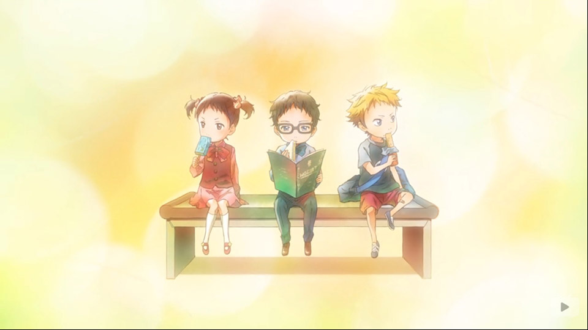
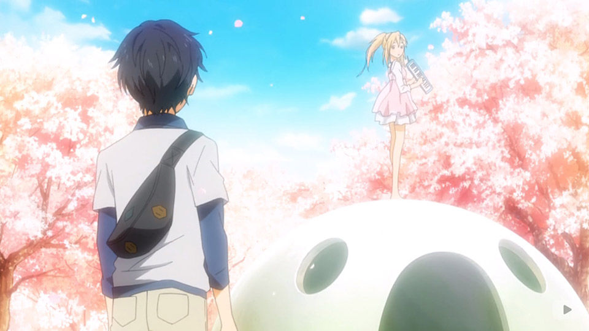
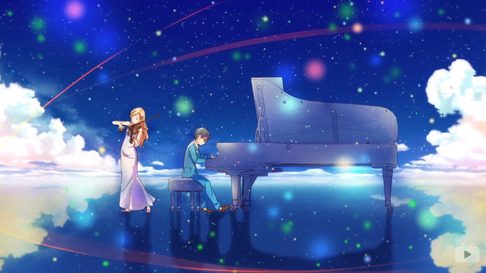
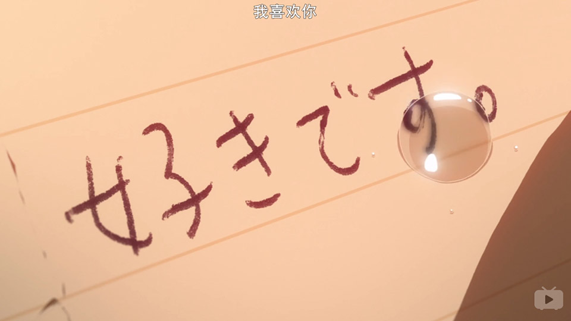
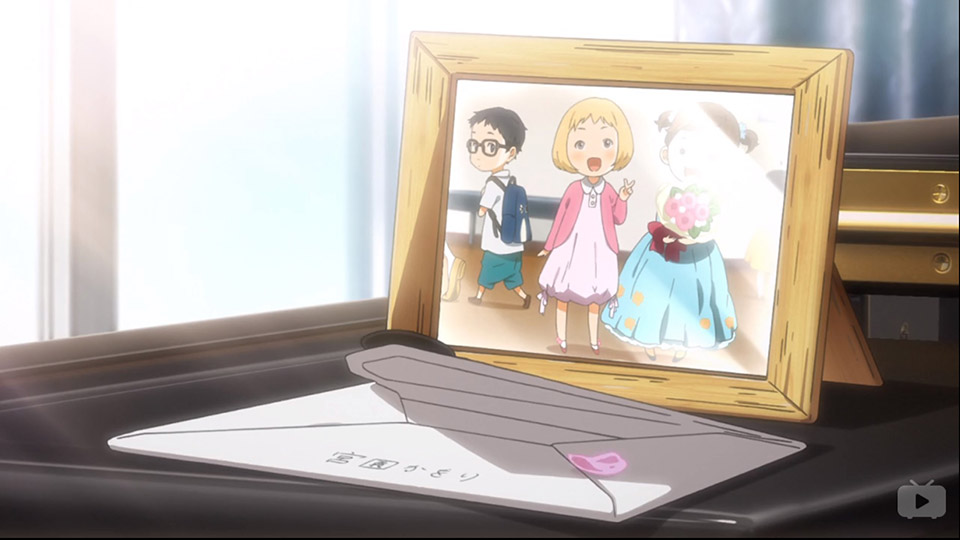
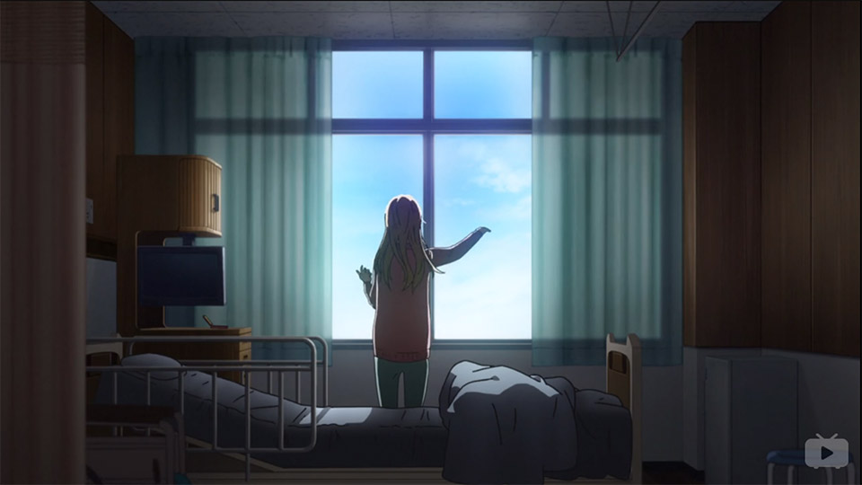
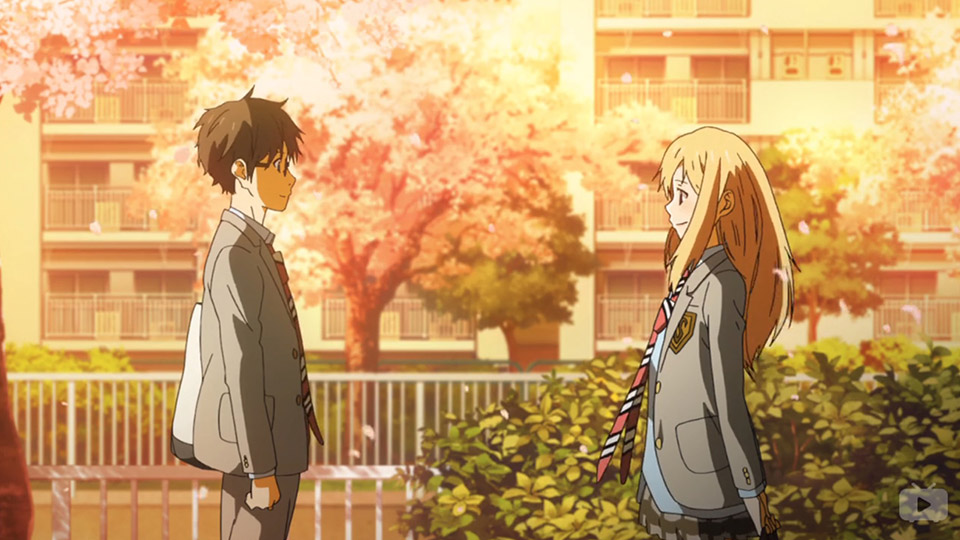
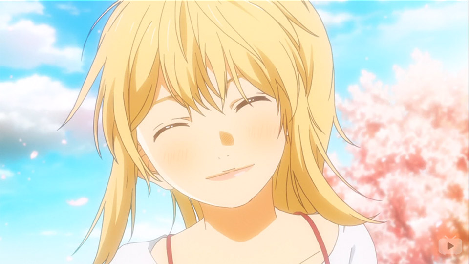

四月是你最深情的告白
===
## 四月は君の嘘 / 四月是你的谎言

## tl;dr
前半段比较正常的校园剧情：女主与废柴男主的日常。介绍男主心理状态等。女主勾搭男主；  
后半段治愈（致郁）向：女主治愈男主，女主因病离世。男主成长，和小伙伴们一起走上人生的旅途。

女主用一个美丽的谎言完成告白后离去。

此番剧情有深度，全篇不宜快进。

个人评价： **4.8** / 5  --  此生无悔入二次元

| Type| Rate |                                       |
|-----|------|---------------------------------------|
| 画风 |**4** | 主角相关细节非常精细，但次要场景稍简陋      |    
| 音乐 |**5** | 钢琴乐可收藏；剧情配乐十分应(cui)景(lei)   |
| 剧情 |**5+**| 生活、写实；极强治愈效果；时间轴叙事；多铺垫 |
| 人设 |**5** | 女主人设5+，对治愈系女主没什么防备         |
| 设定 |**4** | 除年龄为初中外，没什么问题                |

<strong style="display:block; text-align:center; color:red;">下文包含剧透内容！</strong>
<strong style="display:block; text-align:center; color:red;">下文部分内容仍在修改中</strong>

## EP19 再见了英雄

剧情收束，武士在预选赛中完成演奏，与心中公生的映像告别，继续走上演奏者的道路。就像小时候第一次听公生演奏后那样，执着、倔强、不服输。这里收束了前段武士、绘见以公生为目标不断超越自己的故事线。对于青春期的少年来说，最好的鼓励便是竞争对手。

这里表现对年少时的玩伴、对手的感谢。收束了番剧友情部分的剧情。

## EP22 春风 Harukaze / True End

每年春风吹过的时候，公生都会想起樱花树下的那个少女吧。那一年的邂逅，改变了两人的人生。

#### 一个人的合奏

公生在台上演奏时脑补了薰与自己合奏的情景。

如公生所说：自己并不善于说辞。他用琴声讲述这个幸福而悲伤的故事。薰让公生开始坦诚面对音乐，他不是母亲的牵线木偶，而是一个有血有肉的，是自由的演奏者。薰让公生灰暗无光的世界重新充满色彩。在看到薰幻影的时候，公生意料到这是最后一次“相见”。遂用音乐表明自己的心意，与薰道别。完成演奏后，公生发现自己早已泪流满面，此时明白了自己对薰的感情是真实的。

#### 四月是你的谎言 / 四月是你深情的告白
在最后一话才解释标题“谎言”的意义：用喜欢公生基友为谎言，走进公生的生活，让他的生活重获色彩。最后，用生命的光亮完成对公生的告白。在看到这封亲笔信的时候，开始泪目。

> 另外，我说了一个谎……就是宫园薰喜欢渡亮太的这件事。这个谎言，将你……有马公生君，带到了我的面前。

如果仅仅是*绝症晚期少女和男主共度时光后幸福离去*，这就和狗血剧没有差别了。**但是**，此时公生并不是薰的男友，不能像偶像剧里那样共度最后的时光。薰知道公生因母亲去世放弃演奏的事。她不希望看到当年让自己喜欢上音乐的“钢琴王子”消沉的样子，她要让公生振作起来。所以她就用生命的最后一年，说了一个美丽的谎言。

> 我想让公生君为我弹钢琴

这是薰与公生故事的开始。薰选择了与武士、绘见不同的道路，她成为小提琴师，想与公生同台演奏。这样她就可以陪伴在公生的身边。然而，她的病打碎了这个梦想，这是颇为遗憾的。薰直到最后都没能与公生完成一场完美的合奏。这里也是薰与武士、绘见不同的地方，后者选择追逐公生的脚步；而薰选择了陪伴：成为一个小提琴演奏者，与公生同台演奏，陪伴公生追逐音乐之梦。

> 我并不能一直在你身边帮助你

EP11的最后，薰以感伤的语气，背对公生说出了这句话。这里是剧情的转折点。**陪伴是最深情的告白。**但薰的绝症没有给她完成告白的机会。既然自己不能陪伴公生享受舞台上的风景，那么至少也应该让公生的时间重新流动…… 接下来是本番的剧情。这里决定了此番将会是治愈系剧情。*两个人在一起的回忆一定会褪色然后消失的，除非有什么东西能不断唤醒这段回忆*（如果以狗血剧的思路，女主离世后，男主这份两人的回忆能维持多久呢）。公生是钢琴师，那么钢琴便是这份情感最好的载体。

> 果然，选择你真是太好了  
> 我需要一个能给我离别之吻的人。

随后，薰回忆了和公生一起度过的快乐时光。对公生来说，薰只是人生的1/5，但对薰来说，公生几乎是生命的全部。因为公生的出现，薰对自己的生命重燃希望；因为薰的出现，平淡无奇的事物在公生眼中也开始有了色彩。公生的出现让薰生命的最后一年充满快乐，薰的出现让公生的时间再次流动。两个人互相支撑，成为对方心中最重要的人。

亲笔信的末尾，**薰坦白了对公生近10年的爱慕**。番剧用前21话铺垫了最后的情感宣泄，薰微笑说出“我喜欢你”的瞬间，高能催泪，前21话中隐藏的感情瞬间溢出。最后“抱歉，未能吃完你带来的全部可露丽”让我对如此温柔的女孩的逝去更加惋惜。**太过温暖以致悲伤**。

## 薰 & 友人A &nbsp; / &nbsp; Kaori + Yujin A

**既然她不能在你的生命中停留，那就微笑着挥手道别，带上她的回忆和梦想。然后，心怀感激地向前走；她的生命永远停在了那个飘雪的冬天，但她让我从今往后的生命如春天一样五彩缤纷。**

> 我和他约好了，“再一次合奏”。所以我也想……拼命努力地挣扎看看。不像样也好，苟延残喘也罢。我想挣扎，挣扎，再挣扎，拼命挣扎到最后。因为我是大家的伙伴，如果因为这样就放弃的话，根本无颜面对生我养我的父母。这是我的人生，如果就这么放弃的话，我真是太可怜了。
>
> 也就是从那时起，我开始奔跑了起来。为了不讲遗憾带进坟墓，我开始过起随性的生活。戴上曾经一度害怕的隐形眼镜，不顾体重飙升地吃蛋糕，随便制定乐谱，并且用自己的方式来演奏。

在病房里，薰通过手机音讯，想象着用小提琴与公生合奏

薰是一个温柔体贴、时而感伤的女孩。薰知道椿喜欢公生，因为自己患有绝症，不能成为陪伴在公生身边的那个人。她不想伤害椿与公生之间的感情。但是，她并没有因此放弃告白，而是勇敢地用另一种式实现陪伴公生的愿望。

在EP18，薰听完公生与小萝莉合奏后泪目。早在EP10，公生就用一首充满四季气息的钢琴曲向薰袒露了自己的心意。那是的公生仍未完成性格的成长。但此次与小萝莉的完美合作证明了公生的成长。薰为公生走出母亲阴影感到激动而流泪；同时也为自己不能与公生合奏感到伤心而流泪。薰在自己病情恶化无法握住小提琴时几乎放弃了合奏的梦想。但公生用行动告诉她：**即使把自己弄得遍体鳞伤也不要放弃抗争现实的黑暗，只有这样你才能抬起头、骄傲地对别人说：这是我的人生，我努力过了，我不后悔！**（这里引用Angel Beats的设定）为了不给自己留下遗憾，薰选择接受手术，挣扎着试图抓住最后的希望。两个人就这样互相鼓励，度过了这一年的时光。

> 音乐是自由的，你就是你。
>
> 薰：我是否住进了你的心房了呢？  
> 公生：连鞋也没脱就住进来了呢。  
> 薰：就算须臾片刻也好…你是否会想起我呢？  
> 公生：我要是忘记的话…你会化身怨灵来找我的吧。  

按补完系的思路：薰帮助公生完成补完。“音乐是自由的，你就是你。”这句话帮助公生走出了母亲的阴影。在EP22的后半段，公生弹琴时不再紧张，更多的是坦诚。纮子说：他变的成熟了。薰让公生离开乐谱的束缚，去追求更深层的东西。——将自己的心象融入音乐，把自己的情感传达给听众。（无限琴制即视感？）这是薰留给公生最珍贵的宝物，是薰对“陪伴”的回答。薰用自己生命的全部点亮了公生的未来，此刻她的心意融入了公生的生命，成为公生梦想的一部分。这份宝物会陪伴着钢琴师直到死去：每当公生触摸琴键，这段温暖而忧伤的回忆重现眼前：陪他坦诚面对音乐，陪他弹奏动人的琴声……

> 在漫天飞舞的樱花下，我遇到了那个命运中的她。和她相遇的瞬间，我的人生也随之改变。所看到的，所听到的，所感受到的… 我周围的风景，全部都染上了绚丽多彩的颜色… 世界，在散发着光辉。

这里有轮回的感觉：小时候，公生让薰的生活变得丰富多彩（EP22，薰父母把亲笔信交给公生）。如今，薰给公生原本灰暗的世界重新染上色彩。这对武士、绘见来说也是同样的，三人同作为钢琴师，互相竞争、互相鼓励，奔跑在自己的音乐之路上。或许这也是编剧对青春期友情的理解。

**如果说现实是灰暗无光的，那么薰就是这现实中的梦想与光芒**。她像樱花一样短暂绽放美丽，然后随风飘落，留下令人惋惜的感慨。同时，惊讶于青春时爱恋竟能给人如此强大的力量。

## 椿 / Tsubaki
女二作为公生的青梅竹马。女二在处理感情方面比较笨拙，一直逃避自己喜欢公生的事实。直到公生说出他想考外地的音乐学校后才意识到自己对公生的情感，为了继续陪伴公生，女二努力学习，准备考取音乐学校附近的高中。在薰去世后，椿表示会一直陪在公生身边。随后全番结束。

椿知道公生喜欢的是薰，仍鼓起勇气向公生告白，公生并没有正面回复。两人的后续发展在番剧中没有提及，这里还是留下了很大的脑补空间。椿给予公生现实的陪伴，薰给予公生心灵的陪伴。公生作为非典型白羊座，属于专一的类型。公生的心已经由薰这位初恋少女填满，或许并没有给椿留下多少空间。因此，椿对公生的爱恋含着苦涩，也许她不能像薰那样走近公生的内心，也许她等不到公生的回答。但换种思路：或许，青梅竹马并不是两人间的互相爱恋，只是想维持这种*两人早已习惯的互相关心与陪伴*。

## 槽点
#### 年龄设定
此番年龄设定在初中二年级。但是全程看下来都以为是高中（身高、心智成熟度完全不像初中生啊！）。霓虹初中生的生活真丰富！

#### 星座设定 / 好基友
公生的设定为白羊座。但按照剧情来看，公生绝对不是典型白羊座性格。与同为白羊座设定的好基友形成强烈反差。好基友作为花心的典范，对女孩的态度自然是能泡就泡。生活态度属乐观型。EP22最后，阿渡手机上仍留有薰的照片，这说明好基友对薰是有好感的。而同时，作为知道薰真实心意的少数人，仍装做喜欢薰的样子，帮助薰完成了这一谎言。就这一点看来，好基友内心或许不像外表那么简单。与好基友相比，公生的专一在白羊座中似乎显得太独特了。

当然，我个人认为公生的白羊座设定没有什么问题。公生的感情外现非常少。但以钢琴师的身份，却能演奏出充满情感的乐曲。这里说明公生内心感情是丰富的，只是不善表达而已。公生沉浸钢琴中，母亲从小严格的教导让他很少有时间与小伙伴玩耍，这是导致他时常自卑的原因：他并不能像阿渡一样轻松得到众人的欢迎，所以也就导致了其专一的性格。

#### 后宫
女二、武士、绘见、兄控小萝莉（凪）对公生都有爱慕之情。女二典型青梅竹马线；武士、绘见在听完公生演奏后将他作为竞争对手，这三人均为演奏者，互相理解、支持(EP18)；小萝莉是兄控（真可怕）。以后宫剧情展开或许会十分有(gou)趣(xue)。

番剧中出了讲述公生、薰、椿、阿渡的故事，还提到了武士、绘见因公生的影响走上演奏着道路的内容。这些内容给番剧增添了实感，给剧情增添了友情，让这段青春故事更完整。

#### 母亲（早希）
全篇戏份不多。从前半段一直以为是鬼母。后半段用薰剧情强力洗白。

母亲对公生近乎严苛的做法存在争议。但以纮子（公生的阿姨）的说法：早希想给公生打下严格(Strict)的基础，以后才能演奏自己的风格、称为钢琴师（完成早希的梦想）。在公生对自己说出诀别话语后微笑，此处完成洗白。

> 我们的孩子现在就要去进行最后的告别了。

薰与公生母亲患有同样的疾病（公生去病房探望薰时眼前闪现自己母亲的画面）。薰鱼母亲疑似患有渐冻症？wait！这样说来母亲和薰是什么关系。

#### 次要场景
次要场景做工比较粗躁，基本可理解为一张图。但在EP中配合主要场景创造了视觉重心，让观众更注意主要情节的观赏。但就整部番剧来说次要细节稍显不足。

## Another Ending / Good Ending
看完EP22大概会期望GE吧：薰恢复健康，与公生合奏，两人一起走演奏者道路；公生开启后宫结局（薰＋武士＋绘见＋小萝莉、椿＋好基友）。只有奇迹才能治愈薰的患渐冻症，奇迹这个东西，我们也只能在二次元里期待一下。

**但是**，走GE线的话，此番就沦为普通的校园番了。

## OST推荐
#### 7!! - オレンジ（Acoustic Ver.）
> 寂しいと言えば笑われてしまうけど  
> 残されたもの　何度も確かめるよ  
> 消えることなく輝いている  
> 雨上がりの空のような  
> 心が晴れるような  

> 若把寂寞说出口 你肯定会笑话我  
> 可我会无数次确认 你残留下的印记   
> 那是 未曾消逝 永恒的光芒  
> 恰似雨后晴空般  
> 又如心间放晴般

配合EP22高能催泪。薰和公生的对白。Acoustic比普通版听起来更符合全番剧情

#### wacci - キラメキ
> 足音(あしおと)刻(きざ)むリズム  
> 雨(あめ)あがり  
> 街(まち)を抜(ぬ)けてゆく风(かぜ)の优(やさ)しい匂(にお)い  
> 同(おな)じ时间(じかん)を分(わ)け合(あ)いながら  
> 二人(ふたり)で过(す)ごせた奇迹(きせき)を  
> これから先(さき)も繋(つな)げたいんだ

> 总在回家的路上  
> 刻下脚步的旋律  
> 雨过天晴  
> 风过街市清香醉人  
> 共同分享时间  
> 让你我走过的奇迹  
> 一起链接到未来吧

## Afterword
我的青春果然被狗吃了。
