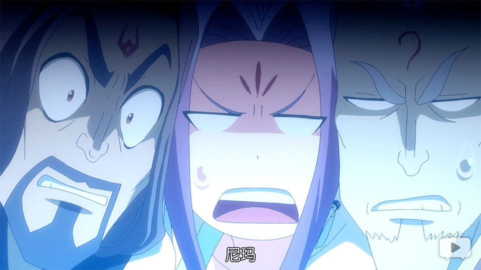
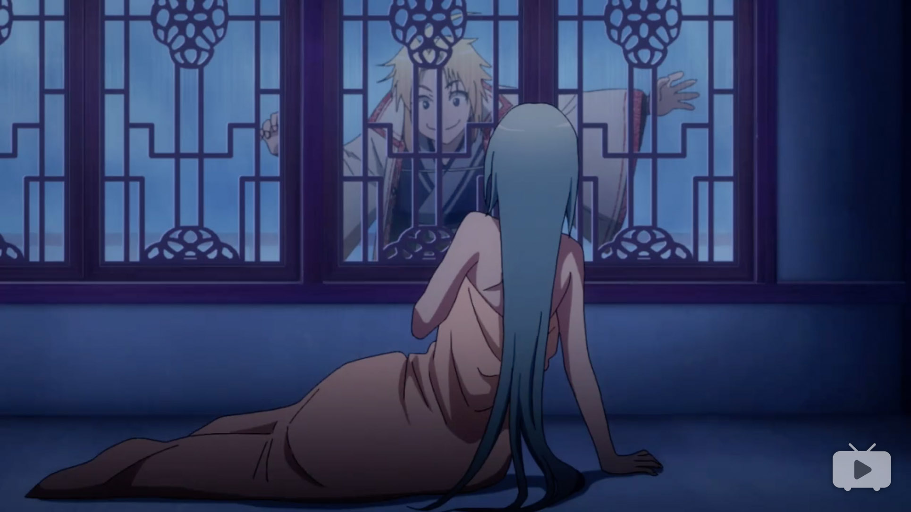
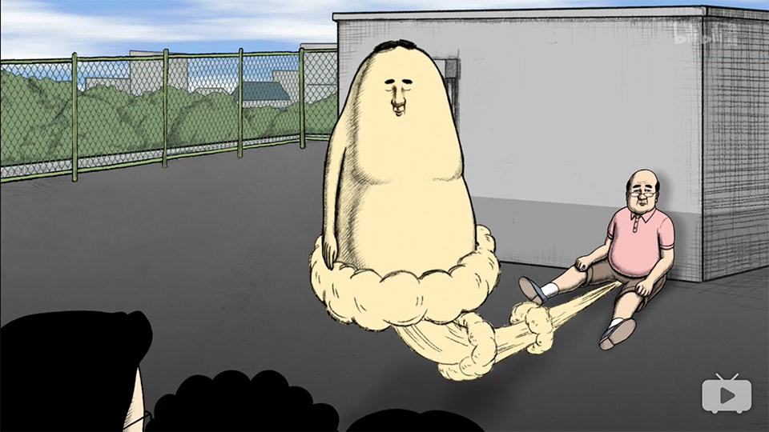
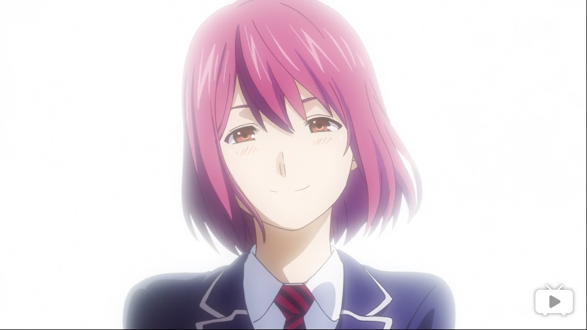
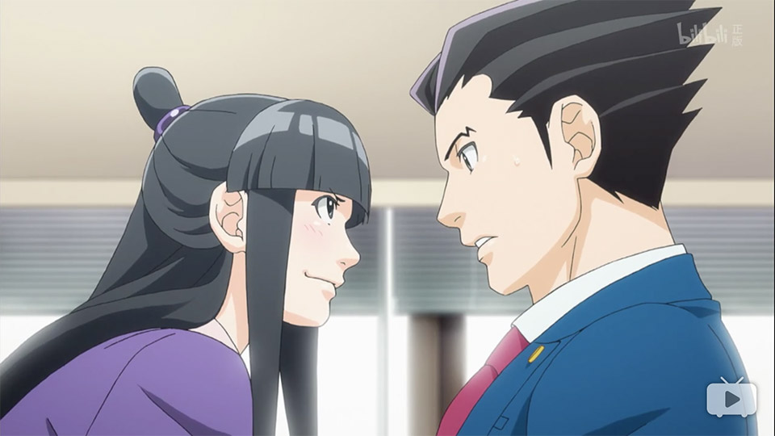
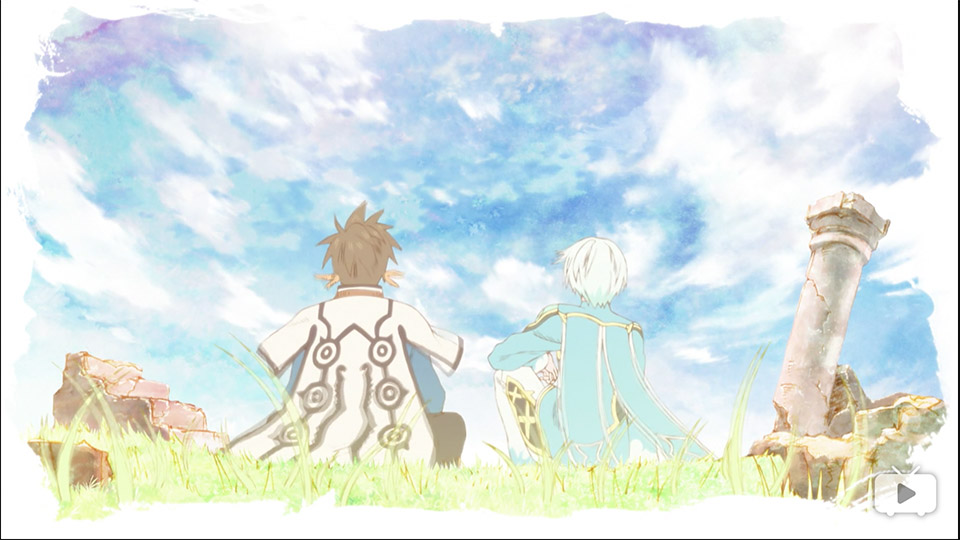
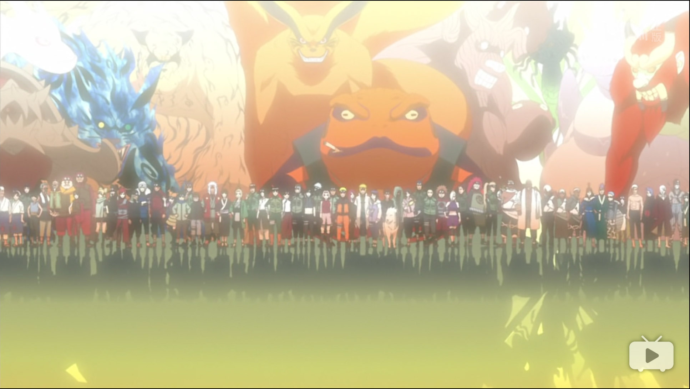

 从前有座灵剑山；
        补番推荐：(4.9/5) 火影忍者
    keywords:    动漫, 番剧, 评价, bangumi, review, ACG
    tags:        动漫
    date:        2017-02-20
~)

2016番剧日志
===

<strong style="display:block; text-align:center; color:lightgreen;">本文不含剧透，请放心食用。</strong>

## ~~从前有座节操山~~ / 从前有座灵剑山

* 奇幻
* 伪后宫
* 吐槽

|     |      |                                           |
|-----|------|-------------------------------------------|
| 画风 |**4** | 中规中矩的日系画风＋滑稽的吐槽状态画风          |    
| 音乐 |**4** | BGM与剧情搭配合适，OP/ED无亮点               |
| 剧情 |**4** | 根据漫画、小说改编                          |
| 人设 |**4** | 部分人设疑似参考了近几年成功的日漫。整体效果不错 |
| 设定 |**5+**| 十分接地气，吐槽在动漫中很有特点               |
**4.4** / 5  --  近几年突破性的国漫作品。**请一定做得更好！**

1月新番。在灵剑山之前，对国漫一直不看好。除了~~光腚~~审核导致剧情无趣外，CV质量历来堪忧。一开始对灵剑山并没有十分期待，因此在看完前几集后的心情可谓用惊喜来形容。

CV思路上从以往_普通话念书_变为_更活泼_的方式。正片穿插方言配音暂且视为国漫一大创新，让人物形象生动了很多。方言配音在动漫届并不少见（日漫中关东、关西腔配音是挺常见的），但结合我国方言繁多的国情，创造出了与众不同的试听感。吐槽部分的Q版画风与CV很好地配合，增加了搞笑元素。

设定上不再局限于全龄段（或者说幼龄段），频繁使用流行用语和ACG宅们熟知的梗，偶尔出现小孩子看了根本把持不住的滑稽元素，给作为奇幻类的本作创造了不错的代入感，对年长（成熟）观众更具吸引力。

就制作过程来说，参照了11区比较成熟的模式：小说→漫画→动漫。商业化选择手办是意料之中。由于国情，本子等福利内容没什么可能性。按片头透露，本作由腾讯动漫发行，未来几年内大概会出灵剑山网游~~（不知又要坑害多少小学生）~~。

本作出口11区同步放送。然而反响并不高，多少有些水土不服的因素。相信有了第一次走出国门的经历，未来会有更多的国漫走向世界。

## 屁屁吾郎 / おなら吾郎

* 日常
* 猎奇

**?** / 5  --  意味不明

无法以常理评价的动画。但是看起来很爽的样子。

## 食戟之灵 贰之皿 （~~春药之灵2~~）

* 美食
* 后宫
* 热血

|     |      |                                        |
|-----|------|----------------------------------------|
| 画风 |**4** | 没有特别的惊喜，质量中上                   |    
| 音乐 |**4** | 中规中矩，剧情关键部分的BGM很应景           |
| 剧情 |**5** | 整部番看下来很爽快，似乎很能让人上瘾         |
| 人设 |**4** | 男主和小伙伴们一起成长的故事                |
| 设定 |**5** | 虽然设定有些无厘头，但是很能让人上瘾         |
**4.4** / 5 麻麻我要看第三季！

延续了第一季的风格，药王继续收后宫（发福利）。B站版疑似删减了福利内容？整体感觉药量不如第一季，但仍建议全程耳机。

个人感觉第二季开始触碰了春药之灵故事的核心，成长。在学员学生看来，男主凭借料理天赋和运气走到了秋季选拔的决赛。而实际上，男主的成功源自*从不因失败而灰心丧气的精神*，仅此而已。秋季选拔后，创真了解了自己和对手的差距，在实地研修中向学员往期生吸收经验，尝试打造自己的独家料理（Specialite），以惊人的速度成长着。

换在现实中，像创真说的那样：“*就算经历了把迄今为止积累起来的自信和自负全部摧毁的惨败，就算碰上了令人再也不能振作起来的悲惨遭遇，明天依然得照常开店营业。这就是料理人啊。*”，能做到这一点的话，离成功不会远。

## 逆转裁判 / 逆転裁判

* 智商

|     |      |                                       |
|-----|------|---------------------------------------|
| 画风 |**4** | A1P（大法）制作，质量有保证               |    
| 音乐 |**3** | 一般，BGM部分没有留下什么印象             |
| 剧情 |**4** | 剧情紧凑，庭审之后真·没有休息             |
| 人设 |**4** | 个性明显，膜法元素十分exciting           |
| 设定 |**3** | 假想世界观，并不切合实际                 |
**** 3.6 / 5 -- 泡面番

本作为游戏改编。按照逆转的世界观，此番讲述原来如此君~~（成步堂）~~和各位检察官~~（后宫）~~在法庭上用膜法（异议あり）还原真相的故事。此番传承了逆转系列的特色（一言不合告证人）。

个人觉得此番看点在原来如此君在法庭上用膜法制造气流冲击检察官、证人、审判长，这一部分比较有娱乐性。其他部分大概只能算作泡面番。对逆转世界的叙述不足，深度不够。

## 热诚传说X

* 奇幻
* 后宫

|     |      |                                       |
|-----|------|---------------------------------------|
| 画风 |**5+**| 我就看看UFO社烧预算……                   |    
| 音乐 |**3** | 中规中矩                               |
| 剧情 |**4** | 游戏改编，剧情推的有点快。故事背景欠缺      |
| 人设 |**4** | 没有特别出彩的地方                       |
| 设定 |**4** | 第二季或许值得期待                       |
**4** / 5  --  特效酷炫的泡面番

游戏改编，剧情压缩的有点过。有点UFO社的特效撑起整部番的感觉。男主和小伙伴合体后的谜之女孩子画风是一大槽点。

个人认为一季的时间并不够叙述传说系列的世界观，此番单独来看也只能算是泡面番。或许第二季能带来惊喜。

## **火影忍者·疾风传 / Naruto:Shippuden**

* 热血
* 人生

**4.9** / 5  --  此生无悔入火影，来世愿望木叶村

