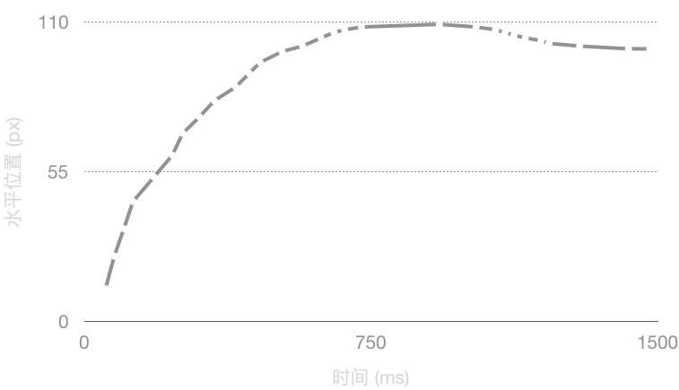

滑动验证码的一种破解
===

验证码 (CAPTCHA) 全名为「全自动区分计算机和人类的公开图灵测试」 (Completely Automated Public Turing test to tell Computers and Humans Apart)，发展至今已有近 20 年历史。

早期验证码通过扭曲文字来干扰计算机自动识别，但这几年神经网络的发展已让这种方式的效果大大降低。为了应对这一现状，近几年出现不少基于交互行为的验证方式，其中之一是滑动验证码。某产品的声称其能够结合人工智能，利用海量数据识别机器脚本。

嗯？听起来很厉害。

恰逢个人项目需要处理某滑动验证码实现自动登录，就很不情愿的尝试了一下破解。测试效果意外的好，通过率大约 80%，足以满足需求。

## 验证过程

需处理的交互流程并不复杂。验证码弹出后会显示一张图像，鼠标点击下方滑块后图像变成一张拼图，此时拖动滑块移动上方拼图，把拼图移到正确的位置即可。我 ~~单身23年~~ 的手速能在 1.5 秒左右完成验证。

验证码的浏览器内代码经过混淆，且无法分析出请求参数的构成，故无法从请求上直接破解。遂祭出大杀器 [puppeteer](https://github.com/GoogleChrome/puppeteer) 模拟完整的浏览器环境。破解过程分为两个步骤，获取滑动量 和 模拟鼠标轨迹。

> 机器人如何避免被发现呢？
> 变得足够像人类就可以了。

## 获取滑动量 / 图像处理

使用 puppeteer 可以直接获取网页的图像。鼠标点击滑块后，验证码从一张完整图片（原始图片）变成拼图。图像在拼图的位置发生了变化，其余部分没有发生明显改变。图片上会出现一个深色区域，该区域的图片内容会在左侧显示为一个黄色边框高亮的带阴影点拼图块。部分验证码包含一个稍微加深的区域，用来干扰简单的识别方法。

> 对计算机而言，图像不过是一串数字，对数字进行变换就可以发现有趣的模式。

首先，计算拼图和原始图片的差异，对每一个像素的 RGB 通道取差值，得到以下图像便于后续处理。非黑色的部分反映了前后变化，对应两个拼图区块和一个迷惑区块。颜色越亮变化越大。

验证流程仅需要两个拼图块水平方向（X轴）的位移，竖直方向（Y轴）的信息是不必要的，于是对上图进行降维打击。在竖直方向上进行聚合操作，取每一列像素的各通道最大值。聚合带来两个好处：首先，后续处理仅需要考虑一维数组，计算量显著降低；其次，通过取最大值，让垂直边界更明显，方便后续识别。

聚合后，图像被简化为三个色带，左侧两个明亮色带对应两个拼图块，右侧较暗的色块对应干扰块。

接下来，对上面的图像进行单色化 (Monotonize) 和 二元化 (Binarize) 操作，就可以得到了两个规整的区域。单色化时对每像素的所有通道取最大值，进一步强化垂直边界。二元化时选定一个阈值过滤掉干扰区块（根据实验效果，最终选定 48 作为分界值）。

因为左侧拼图快有阴影，在二元化后宽度比真实宽度要宽一些，但该阴影大体上是左右对称的，不影响中心位置的计算。

最后，从左往右扫描，记录下颜色发生变化的位置。理想情况下，会观测到四次跳变。前两次跳变标识拼图滑块的位置，后两次标识拼图的目标位置。取两个区域中点的水平坐标，计算两者之差得到拼图位移量。

少数情况下：两个拼图区块距离很近，此时得到的区块会合并为一个；或者，拼图区块中有一条深灰色的竖直线，此时图片的差异较小，二元化后变成黑色区域，将拼图快一分为二。上述处理方式没有应对这两种情况。但从实际使用来看，获取一个新的验证码即可。

<!-- TODO: add graph -->

## 鼠标轨迹模拟
检查网页事件监听器后，发现验证码模块监听了 `mousemove` 事件来获取鼠标轨迹。按照 W3C DOM 标准，该事件的触发频率由浏览器决定，每次触发时鼠标位置一定与上次不同。在 Chrome 中测试发现该事件触发间隔至少为 16 毫秒（对应每秒60帧）。于是鼠标轨迹模拟转换成生成一个 `(鼠标位置, 触发间隔)` 的不定长序列。

因为人类产生的鼠标移动轨迹一定不是完美的，所以轨迹需要一定的随机化处理。太完美的轨迹反而会被判定为机器模拟（例如，位移对时间的线性函数）。

基本思路是：根据位移量决定事件触发次数，然后使用某种缓动函数 (Easing function) 计算移动位置，触发间隔在基础间隔（试验后选择 33毫秒）的基础上随机增减一定范围。下图是基本思路下生成的一个轨迹：

更高级的思路则是采集自己的鼠标轨迹，然后拟合一个模型去重现轨迹。即所谓「用人工智能干掉人工智能」。但基本思路在实验中表现良好，就暂时没有开发这个思路。

## 效果
进行了 50 次实验，43 次通过验证，成功率 86%。短时间多次测试以后发现通过率明显下降，疑似是模式被发现，重新设置缓动参数可恢复。

下面是实际运行的效果，其中两次白色闪烁是截取屏幕。

<!-- alternatively, GIF -->
<video style="max-width: 300pt; width: 100%; display: block; margin: 0 auto" autoplay autobuffer height="328" width="458" loop muted playsinline preload="auto" src="./captcha-demo.mp4"></video>

## So what?

那么滑动验证码的优势在哪里？从单次验证来看，相比于文字验证码，滑动验证码的破解难度不一定更高。前者的破解需要对特定验证码生成器调整文字识别模型的参数吗，这是一个费时费力的过程；而后者的破解可能用一些规则化的手段（例如本文对方法）就可以达到足够好的效果。

但滑动验证码的破解模式不具备可伸缩性 (Scalability)，文字识别模型训练好后可以大规模部署，单次识别的成本非常低（大约数十 MB 的内存），在几毫秒内就可以完成破解。而滑动验证码需要模拟完整的浏览器环境（大约数百 MB 的内存），并且每次破解都要模拟出鼠标轨迹，考虑到人类实际的操作速度，单次轨迹可能需要数秒完成。

对个人用户来说（比如，写自动化脚本），伸缩性不是一个问题。大多数情况下，个人用户只需要处理少数的验证码情形。而对黑产来说，能够短时间内处理大量验证码的能力是至关重要的。所以说，滑动验证码的安全性不在于难度，而是时间消耗。

从另一个角度来看，为什么不提供 API 给合法用户呢？这样大家都可以省时省力。

---

上述过程的实现可以在 [wacky6/gt-crack](https://github.com/wacky6/gt-crack) 获取，遵循 GPL-3.0 协议。轨迹生成的代码没有完全公开，因为公开后必然引起通过率衰减。

<a style="text-decoration: none;" title="wacky6/hikaru" href="https://github.com/wacky6/hikaru/"><ruby>Hikaru / 🌟<rt>君は私の光。 </rt></ruby></a>
