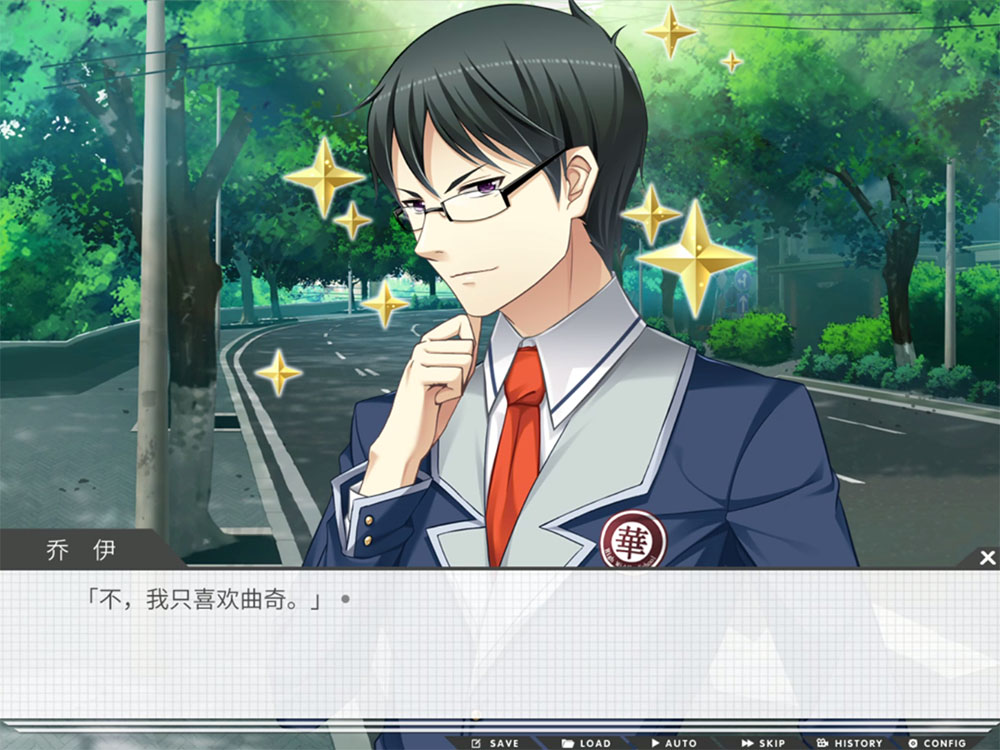
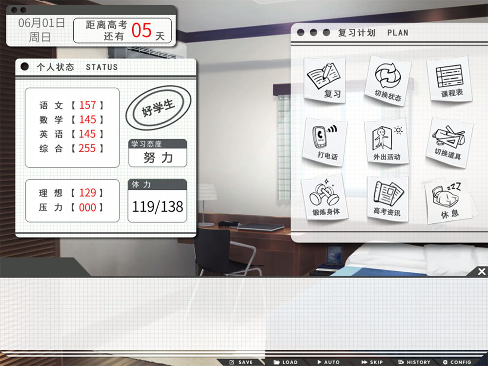
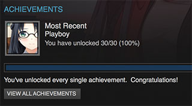

 – 但愿以后做得更好
    keywords: 游戏, 评价, 高考恋爱100天
    tags:     游戏
    ctime:    2016-05-16
    mtime:    2016-05-16
~)

高考单身100天
===

高考恋爱100天
---

<strong style="display: block; color: red; text-align: center">下文包含轻微剧透！</strong>

## TL;DR
如果你喜欢GalGame或Visual Novel，《高恋》是一部很不错的作品。背景非常有中国特色（正面含义）地设定在了高考前的一学期，玩家的选择会决定高考的结果（以及是否有妹子）。玩家需要在妹子和学习之间平衡以取得期望的结果。但游戏整体仍有不少令人不满意的地方。

游戏后期可以使用特殊道具达成好人品（网吧少年上清华）、坏人品（学霸落榜去复读）结局。结局设定包括了近些年高考期间的各种奇葩事件。游戏可玩性尚可，多周目后剧情重复，如果不是为了成就估计没有人会打N周目。

个人评价：**7.9** / 10 -- Good，但愿以后做的更好

---

## 正文

本来，自仙剑3后，我的内心是拒绝国产游戏的。五一恰逢某果打折，抱着好奇的心态，花20¥不到入了《高恋》。本传已通关，资料片还没开始推，私以为这个游戏还是非常吼的。

高恋告诉我们：

* ~~想要考上好学校，你需要一个靠谱的妹子~~
* 单身狗通常不能考到好学校
* 家长不要管谈恋爱的事，否则结局会很糟糕（一起上清北 vs 复读和三本）
* 培训班是坑¥的，除非有个妹子陪你
* ~~如果现在放弃的话，高(bi)考(sai)就结束了~~

养成系统结合了flag和数值判定，与传统GalGame相比是一个不错的创新。玩家需要在学习、玩耍、陪妹子之间寻找平衡点。~~专心泡妹子并不能达成Good End喔！~~

角色的状态会影响到学习效率（压力、信仰）。游戏中有突发事件影响学习能力（比如发烧、失恋、吵架）。游戏流程中可以获得道具，改变能力和状态。整体上很好的模拟了高三的生活状态。

配乐和CV的制作非常用心，代入感很不错。强烈推荐BGM钢琴曲[Nuit Silencieuse](http://music.163.com/#/song?id=34916301)。

## 剧情

简单的说，可以选择：

* 需要慢慢养成的妹(lo)妹(li)
* 作为青梅竹马的妹(yu)子(jie)
* 好(zhe)基(♂)友(xue)
* ~~单身汪~~

一周目顺利通关单身狗GE~~（似乎非常符合现实，然而并没有真爱在身边xD）~~。二周目本想推木馨线，但被好感度和能力值坑入狂战GE线。三周目弃疗，果断放弃木馨进小涵线，遂获得真爱线GE。

四周目以后，尝试不同玩法通其他ED。通关全ED后得出结论：木馨线是阴谋，我选择真爱。

在知道青梅竹马的心意（aka. 游戏背景）后，向别的妹子表白（aka. 游戏开场）简直是丧心病狂，我不要辜负真爱。

> 只要你接受了她。不论怎样，她都会在你身边。

## 槽点

制作组的一些创新也是游戏的缺陷。

从游戏性上来说：可怕的ED数量和极高的剧情重复度破坏了可玩性，如果不是为了刷成就，很少会玩超过10个ED；其次，在游戏开头，玩家还不了解游戏角色的时候，强行塞一个妹子给玩家，导致玩家处于懵逼状态不知所措（至少我在打一周目的时候是这么想的）；最后，部分Flag判定可能过于严格（比如ED30、700分成就），玩的时候有弃疗的冲动。

设定上来说：强行让玩家和木馨交往缺少现实基础（参考小涵线、被家长拆散线的信息）。我并不认为一个（正常的）汉子会放弃青梅竹马去向一个自己不了解的妹子表白并交往。如果照这个思路，木馨线似乎是因为想不出更好的设定而为了做GalGame才硬生生加上的。

游戏有Steam版和实体版。据说因为版权问题，Steam版阉割了调查兵团和Cosplay剧情，追加家庭教师~~（怪蜀黍）~~路线。DLC1追加班长路线，可以愉快的去NTR别人了~~哈哈哈哈哈~~。

---

总的来说，高恋确实给人眼前一亮的感觉：游戏设定不乏创新，但在整体设计上略有欠缺；高质量的CV和音乐改变了玩家对国产游戏配音破坏游戏体验的糟糕印象。

全成就达成！

似乎离*在现实中找到对象*越来越远了耶。汪汪汪～

