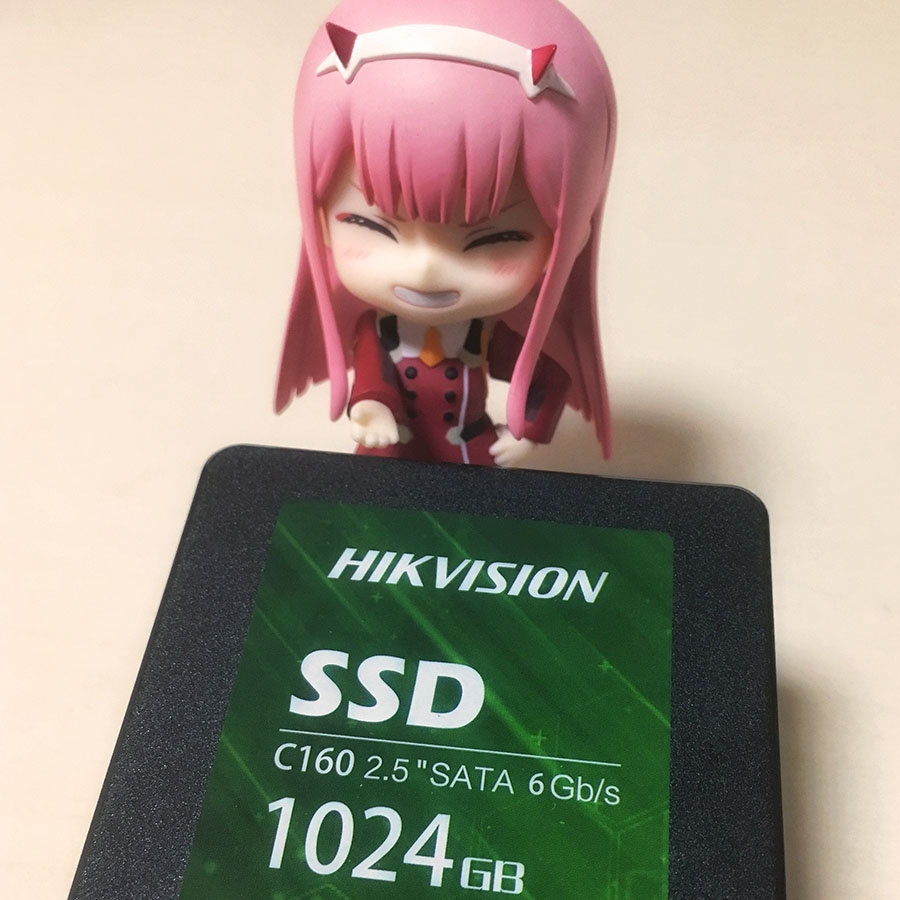
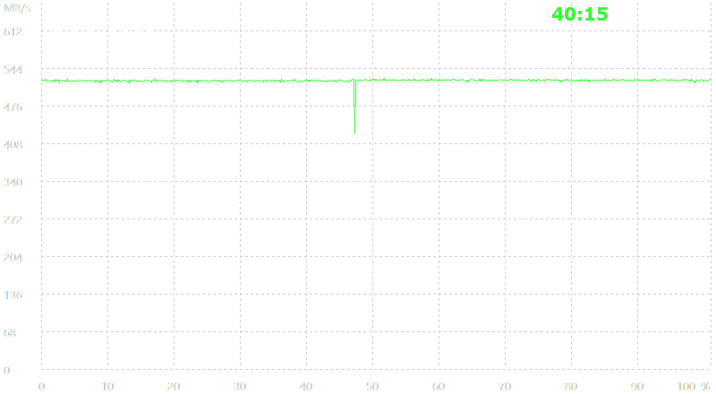
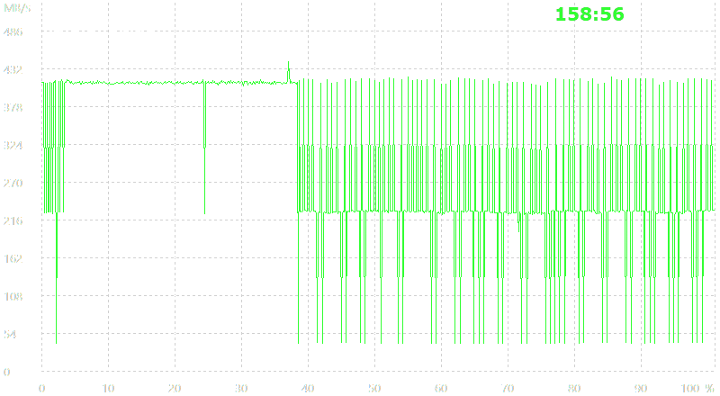

海康威视 C160 性能测试
===

## TL;DR

* \+ 顺序读写性能足够用
* \+ **价格低廉**（¥0.6 / GB）
* \+ **SMART 数据详细**，可据此制定策略更换新盘

* \- 持续高负载写入性能可能不稳定
* \- 三年质保；三星提供五年质保但限制总写入量

C160 适合作为加速盘，存储非关键数据。追求高性能的话，还是 NVMe 吧。

## 读写性能

以下数据使用 TF T5 炼丹炉，在 Windows 10 下用 AIDA64 测出。

C160 花费 649 软从某宝购入，包装封口完好，初始 SMART 通电次数为 5，通电小时数和写入计数均为 0，触点未见插拔痕迹。推测不是二手盘。

两块对比 SSD 为：三星 840 Pro，SATA3接口，已使用 5.5 年，总计写入 15.2TB；三星 SM961 （工包960 Pro），NVMe接口，已使用 1.5年，总计写入 2.5TB。

### 顺序读取
衡量最大吞吐量和全盘一致性。

|        | C160      | 840 Pro   | SM961     |
|--------|-----------|-----------|-----------|
| 最大    | 524 MB/s  | 528 MB/s  | 2962 MB/s |
| 最小    | 331 MB/s  | 396 MB/s  | 2096 MB/s |
| 平均    | 521 MB/s  | 500 MB/s  | 2525 MB/s |

### 访问时间
衡量 SSD 的响应速度。

|          | C160     | 840 Pro | SM961    |
|----------|----------|---------|----------|
| 最小访问  | 0.02 ms   | 0.08 ms | 0.05 ms |
| 最大访问  | 0.04 ms   | 0.10 ms | 0.05 ms |
| 平均访问  | 0.04 ms   | 0.09 ms | 0.05 ms |

### 顺序写入

顺序写入表现出乎意料。全盘性能很不稳定。平均读取速度 300 MB/s 中规中矩。但 AIDA64 测出的写入性能在 40 MB/s 与 442 MB/s 之间剧烈抖动。

这样的性能曲线我第一次见到。相比之下，我的 840 Pro 和 SM961 在刚买入时的性能曲线很平滑。推测 C160 晶元擦写调度有问题，导致它不能适应持续满负载写入。

Windows 下 NTFS 分区拷文件稳定在 420MB/s；Linux 下 ext4 分区拷文件稳定在 500MB/s。

### 4K 随机读写

用来衡量间断的小文件读写。

|          | C160     | 840 Pro | SM961    |
|----------|----------|---------|----------|
| 4K 随机读 | 108 MB/s | 90 MB/s | 206 MB/s |
| 4K 随机写 | 56 MB/s  | N/A     | N/A      |

因为 840 Pro 和 SM961 都有数据，没有进行写入测试做对比。大多数 SSD 的 4K 随机写入大约为随机读取的一半速率，C160在这里的表现符合预期。

## SMART
以下几个参数非常有意思。参照单晶元的最大、最小、平均擦写次数 (A5,A6,A7) 和最大擦写次数规格 (A8)，可以制定策略在 C160 失效前更换新盘。一种激进的策略是 A5 参数达到 A8 的 80% 时更换。

840 Pro 和 SM961 并不会报告这些的参数。大概是三星对自己的主控算法足够自信，认为用户不需要知道这么细节的参数。

| ID | 名称 | 推测作用 |
|----|-----|---------|
| A5 | Maximum Erase Count       | 单晶元的最大擦写次数 |
| A6 | Minimum Erase Count       | 单晶元的最小擦写次数 |
| A7 | Average Block Erase Count | 晶元的平均擦写次数 |
| A8 | Max Erase Count of Spec   | 晶元的最大擦写次数规格 |
| A9 | Percentage Lifetime Remaining | 剩余寿命百分比 |
| E8 | Available Reserved Space  | 可用备用晶元（疑似百分比）|

C160 报告 A8 参数为 7000，但我个人对此持怀疑态度。通常来说 MLC 的擦写次数约为 3000-5000。

## 部署
C160 已连入 [gen10 / 存储姬](/blog/microserver-gen10/)，采用 ext4 文件系统。它作为加速盘暂存下载姬、[hikaru 计划](https://github.com/wacky6/hikaru) （录屏姬、超级弹幕姬）的数据。并在每天8点（中国标准时间）通过 `crontab: rsync` 向 HGST 8T 同步数据完成持久化存储。目前 C160 的每日写入量大约为 5G。此部署下，HGST 8T 大多数时候处于低功耗状态，可以节约 10-15W 的功耗。

需要注意，gen10 的硬盘位需要 3.5" 硬盘。但市面上大多数在售的 2.5" 至 3.5" 转换托架的接口位置不正确，不能让 SSD 接口对准 SATA 面板。也可以不使用托架，直接将 SSD 插入 SATA 面板，但拆卸时比较麻烦，操作不当可能损坏插槽。