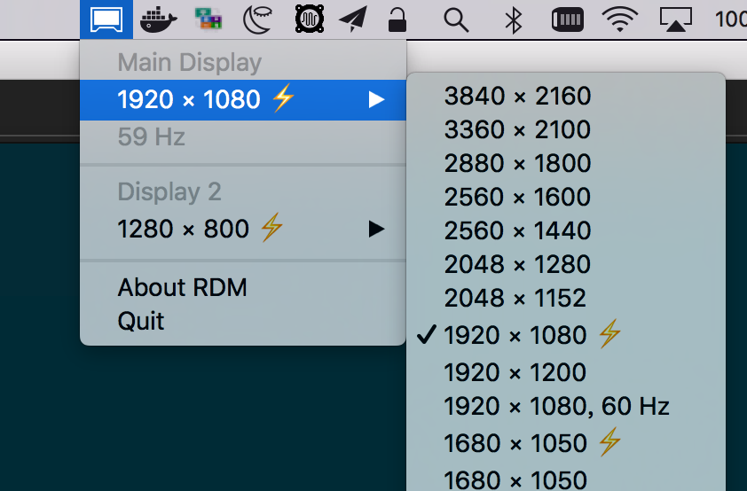

[](~
    ctime: 2017-01-21
    mtime: 2017-01-21
    tags: 其它
    keywords: macOS, OS X, HiDPI, external monitor
    description: 通过修改 plist 开启 macOS 外接显示器 HiDPI。
    brief: |
        通过修改 plist 来开启 macOS 外接显示器的 HiDPI 功能。

        DisplayPort 下 Dell P2416D、Dell P1418D 测试成功。
~)

macOS 开启外接显示器 HiDPI
===

## TL;DR
[一键生成HiDPI配置](#one-key)

**须使用 DisplayPort；HDMI 无效果**

### 1. 打开系统HiDPI (在终端运行）
```bash
sudo defaults write /Library/Preferences/com.apple.windowserver DisplayResolutionEnabled -bool YES
```

### 2. 获得显示器信息

获得显示器的 VendorID 和 ProductID （制造商ID 和 产品ID），在终端运行：

```bash
ioreg -lw0 | grep IODisplayPrefsKey | grep -o '/[^/]\+"$'
```

输出大概是这样的：
```text
> ioreg -lw0 | grep IODisplayPrefsKey | grep -o '/[^/]\+"$'
/AppleBacklightDisplay-610-a029"
/AppleDisplay-10ac-a0c4"
```

这条指令的输出会有多个，注意识别你想要调整的显示器。第一条`AppleBacklightDisplay-610-a029`是MBP的内置显示屏。第二个是外接显示器。（当然，也可以合上 MBP 屏幕，这样只会输出正在使用的外接显示器）

关注`AppleDisplay-**-**`，`-`分隔了两个十六进制数。第一个为VendorID，第二个为ProductID。以我的环境为例：VendorID为`10ac`，ProductID为`a0c4`。（机智的小伙伴发现这是一台Dell P2416D）

### 3. 制作配置
水果的 plist 是 xml 变体，你可以手动写配置文件，也可以用文末的一键生成器。

```xml
<?xml version="1.0" encoding="UTF-8"?>
<!DOCTYPE plist PUBLIC "-//Apple//DTD PLIST 1.0//EN" "http://www.apple.com/DTDs/PropertyList-1.0.dtd">
<plist version="1.0">
<dict>
    <key>DisplayProductID</key>
    <integer> **** </integer>       <!-- ProductID的 十进制 形式 -->
    <key>DisplayVendorID</key>
    <integer> **** </integer>       <!-- VendorID的 十进制 形式 -->
    <key>scale-resolutions</key>
    <array>
        <data> **def-1** </data>    <!-- HiDPI定义1 -->
        <data> **def-2** </data>    <!-- HiDPI定义2 -->
    </array>
</dict>
</plist>
```

要创建HiDPI分辨率，在`scale-resolutions`中增加两个`<data>`项，分别为**希望得到的分辨率**和**缩放分辨率**。例如，我想要创建1920x1080的HiDPI设置，def-1对应1920x1080，def-2对应3840x2160。

`<data>`内部的base64编码后的4个UInt32BE（大端存储的32位无符号整数），格式如下：

|         | UInt32 | UInt32 | UInt32 | UInt32   |
|---------|-------------------------------------|
|         |  宽度  |  高度  |  Flag   |  Flag    |
| 十进制   | 1920  | 1080   |         |          |
| 十六进制 | **00 00 07 80** | **00 00 04 38** | 00 00 00 01 | 00 20 00 00 |

我们需要修改的是宽度和高度，Flag部分不要改动。

把上面这串二进制数进行Base64编码，可以得到：`AAAHgAAABDgAAAABACAAAA==`和`AAAPAAAACHAAAAABACAAAA==`。把这个字符串填到对应的`<data>`标签内。


[](< #copy-conf >)
### 4. 复制配置到系统目录
```bash
# OS X 10.11及以上
DIR=/System/Library/Displays/Contents/Resources/Overrides
# OS X 10.10及以下
DIR=/System/Library/Displays/Overrides

# 把 ${VID} 和 ${PID} 替换成上面获得的VendorID和ProductID
CONF=${DIR}/DisplayVendorID-${VID}/DisplayProductID-${PID}

sudo mkdir -p ${DIR}
sudo cp 配置文件 ${CONF}
sudo chown root:wheel ${CONF}
```

### 5. 安装Retina Display Manager
RDM 用来切换屏幕分辨率，在这里找安装包：[RDM Binary Release](http://avi.alkalay.net/software/RDM/)

如果使用 macOS Serria，需要允许任意来源的应用，参见：[macOS安装任意来源应用](http://osxdaily.com/2016/09/27/allow-apps-from-anywhere-macos-gatekeeper/)。

### 6. 重启！用RDM切换分辨率
重启后运行 RDM，在任务栏中找到 RDM 的 logo，点开来切换分辨率。带有⚡️标识的为 HiDPI 分辨率。


### 存在的问题
用本文的方式开启 HiDPI，合上 Mac 屏幕，外接显示器黑屏。将外接显示器分辨率切换到屏幕原始分辨率后可以正常地仅使用外接显示器，原因未知。因对我的工作方式没有影响，没有继续研究下去。


[](< #one-key >)
## 一键生成

生成后，在终端中按照 [上面的指令](#copy-conf) 把配置文件拷贝到系统目录。

<div class="hint">需要 IE 9+，Chrome，Firefox，Safari</div><div id="onekey-gen"></div>

<style>
.hint {
  margin: .5em 0;
  font-size: 80%;
  font-weight: initial;
  opacity: 0.8;
}
</style>

<script>
'use strict'
;(function(){

var PLACEHOLDER = '1920 1080, 1600 900'
var STYLE_FORM = { display: 'inline-block' }
var STYLE_LABEL = { display: 'block' }
var STYLE_FIELD_NAME_INLINE = { display: 'inline-block', width: '10ch', textAlign: 'right', marginRight: '1ch' }
var STYLE_BUTTON = { display: 'block', height: '2em', padding: '0 2ch', margin: '.5em auto', textAlign: 'center', cursor: 'pointer' }
var STYLE_RESOLUTION_LIST = { width: '40ch', maxWidth: '100%' }

function $(sel) {
    return document.querySelector(sel)
}

function createStyleString(style) {
    function camelCaseToHyphen(str) { return str.replace(/[A-Z]/, function(r) { return '-'+r.toLowerCase() }) }
    var decls = []
    for (var key in style)
        decls.push( camelCaseToHyphen(key) + ':' + style[key] )
    return decls.join('; ')
}

function $el(decl, refs, models) {
    refs = refs || {}
    models = models || {}

    var tag = decl.tag || 'div'
    var html = decl.html
    var children = decl.children || []
    var classes = decl.class || decl.classes || []
    var attrs = decl.attrs || {}
    var ref = decl.ref
    var model = decl.model
    var style = decl.style || {}

    var el = document.createElement(tag)

    if (classes)
        attrs.class = typeof classes === 'string' ? classes : classes.join(' ')

    if (style)
        attrs.style = createStyleString(style)

    for (var key in attrs)
        el.setAttribute(key, String(attrs[key]))

    if (html)
        el.innerHTML = html
    else
        children.forEach( function(child){ el.appendChild( $el(child, refs, models) ) } )

    if (ref)
        refs[ref] = el

    if (model)
        el.addEventListener('input', function(e) { models[model] = e.target.value } )

    return el
}

function saveAsFile(blob, filename) {
    if (navigator.msSaveBlob) {
        navigator.msSaveBlob(blob, filename)
    } else {
        var link = document.createElement('a')
        var url = URL.createObjectURL(blob)
        link.setAttribute('href', url)
        link.setAttribute('download', filename)
        link.style.display = 'none'
        document.body.appendChild(link)
        link.click()
        document.body.removeChild(link)
    }
}

document.addEventListener('DOMContentLoaded', function() {
    console.log('onekey-gen: injecting')

    var refs = {}, models = {}

    // initialize
    $('#onekey-gen').appendChild( $el({
        tag: 'form',
        style: STYLE_FORM,
        children: [
            { tag: 'label',
              style: STYLE_LABEL,
              children: [
                  { tag: 'span', style: STYLE_FIELD_NAME_INLINE, html: 'VendorID' },
                  { tag: 'input', model: 'vid', attrs: { placeholder: '10ac', type: 'text', maxlength: 4 } }
              ]
            },
            { tag: 'label',
              style: STYLE_LABEL,
              children: [
                  { tag: 'span', style: STYLE_FIELD_NAME_INLINE, html: 'ProductID' },
                  { tag: 'input', model: 'pid', attrs: { placeholder: 'a0c4', type: 'text', maxlength: 4 } }
              ]
            },
            { tag: 'label',
              style: STYLE_LABEL,
              children: [
                  { tag: 'span', style: STYLE_FIELD_NAME_INLINE, html: '分辨率' },
                  { tag: 'input', model: 'resolution', style: STYLE_RESOLUTION_LIST, attrs: { placeholder: PLACEHOLDER } }
              ]
            },
            { tag: 'button',
              ref: 'generate',
              style: STYLE_BUTTON,
              html: '生成&amp;下载配置'
            }
        ]
    }, refs, models) )

    function generatePlist(vid, pid, resolutions) {
        function getResolutionBase64(w, h) {
            var buf = new ArrayBuffer(16)
            var view = new DataView(buf)
            view.setUint32(0, Number(w))
            view.setUint32(4, Number(h))
            view.setUint32(8, 1)
            view.setUint32(12, 0x00200000)
            return btoa(String.fromCharCode.apply(null, new Uint8Array(buf)))
        }

        var result = ''
        function L(str) { return result = result + str + '\n' }
        L('<?xml version="1.0" encoding="UTF-8"?>')
        L('<!DOCTYPE plist PUBLIC "-//Apple//DTD PLIST 1.0//EN" "http://www.apple.com/DTDs/PropertyList-1.0.dtd">')
        L('<!-- Generated Using: ' + window.location.href + ' -->')
        L('<!-- By wacky6 -->')
        L('<plist version="1.0">')
        L('<dict>')
        L('    <key>DisplayVendorID</key>')
        L('    <integer>' + Number(vid).toString(10) + '</integer>')
        L('    <key>DisplayProductID</key>')
        L('    <integer>' + Number(pid).toString(10) + '</integer>')
        L('    <key>scale-resolutions</key>')
        L('    <array>')

        resolutions.forEach( function(res) {
            L('        <data>' + getResolutionBase64(res[0], res[1]) + '</data>    <!-- ' + res[0] + 'x' + res[1] + ' -->')
            L('        <data>' + getResolutionBase64(res[0]*2, res[1]*2) + '</data>')
        } )

        L('    </array>')
        L('</dict>')
        L('</plist>')

        return result
    }

    refs.generate.addEventListener('click', function(e) {
        e.preventDefault()

        var re_hex = /^[0-9a-z]+$/
        var re_resolution = /^([0-9]+\s+[0-9]+\s*,\s*)*[0-9]+\s+[0-9]+$/

        var _vid = (models.vid || '').toLowerCase()
        var _pid = (models.pid || '').toLowerCase()
        var _resolution = models.resolution || ''

        // check input
        if ( ! re_hex.test(_vid) )
            return alert('VendorID格式不正确')

        if ( ! re_hex.test(_pid) )
            return alert('ProductID格式不正确')

        if ( ! re_resolution.test(_resolution) )
            return alert('分辨率列表格式不正确。请用英文逗号分隔多个分辨率。')

        var vid = parseInt(_vid, 16)
        var pid = parseInt(_pid, 16)
        var resolutions = _resolution.split(/\s*[,]\s*/g).map( function(s){ return s.split(/\s+/).map( Number ) } )

        var conf = generatePlist(vid, pid, resolutions)
        var blob = new Blob( [conf], { type: 'application/x-plist' } )
        var filename = 'DisplayProductID-' + Number(pid).toString(16)

        saveAsFile(blob, filename)

        alert('配置文件已下载为：'+filename)
    })
})

})();
</script>
