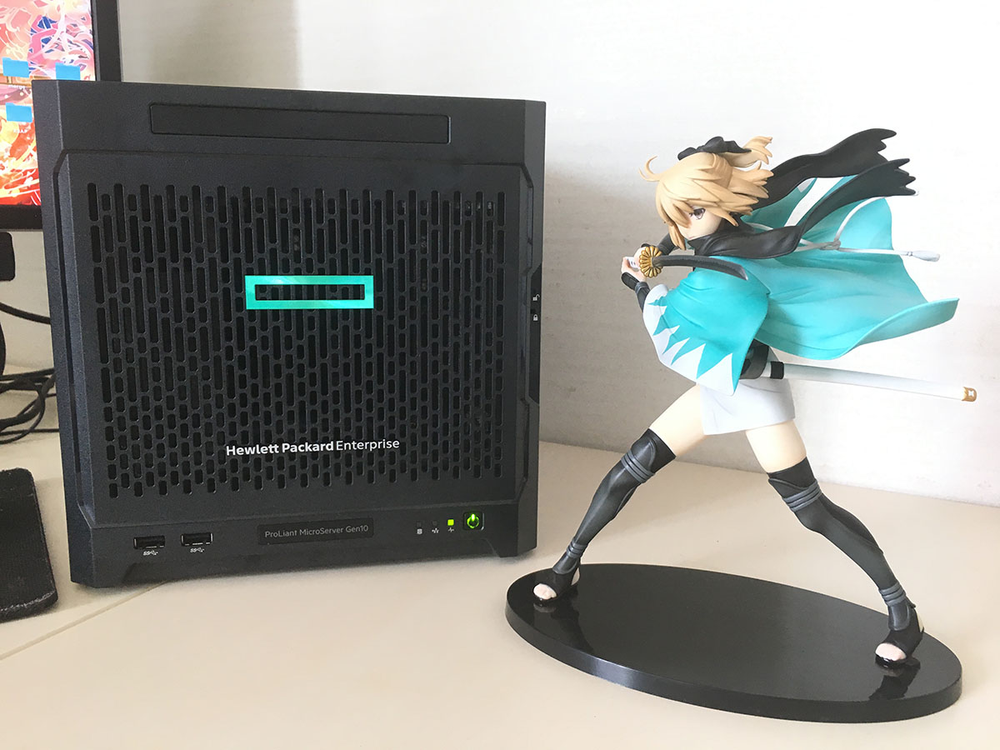

[](~
  title:       Gen10 简评 / 第三代存储姬
  description: HPE Microserver Gen10 简评，第三代存储姬设计
  mtime:       2018-07-14
  ctime:       2018-07-14
  keywords:    storage, design, personal cloud
  tags:        其它, 技术
  brief: |
         本着“生命不息，折(zuo)腾(si)不止”的精神和“数据无价”的原则，重金购入 HPE Microserver Gen10 打造第三代存储姬。

         本文包括 Gen10 简评、存储姬设计的考虑、存储姬计划7年以来踩过的坑。
~)

Gen10 简评 / 第三代存储姬
===

## TL;DR

<style>
.list {
  list-style: none;
  padding-left: 0;
  line-height: 1.2;
  margin: 1.5em 0;
}
.list.pros, .list.pros strong {
  color: #67C23A;
}
.list.cons, .list.cons strong {
  color: #E6A23C;
}
a {
  text-underline-position: under;
}
</style>

[](< .list .pros >)
* \+ 很**安静**，比空调声音小
* \+ 比较**省电**，待机约 16W
* \+ ECC 内存，长期运行**稳定**
* \+ 正常 x86 PC BIOS，配置**方便**
* \+ **两个** PCIe （x8 和 x4,均为开放式插槽），可用光线卡和阵列卡
* \+ 没有 Intel ME 超级后门
* \+ 正常 PC BIOS，不需要折腾光驱位引导

[](< .list .cons >)
* \- 颜值不如上一代 Gen8
* \- CPU 不可换，性能较弱
* \- 没有 Intel 信仰加成
* \- 目前没有 ESXi 官方虚拟化支持
* \- **慎入**企业级硬盘

---

本着 “生命不息，折(zuo)腾(si)不止” 的精神，在二代存储姬容量使用达到 95% 的时候，重金购入 HPE Gen10 打造第三代存储姬。



## 采购 / 硬件

考虑到 CPU 不可换，未来不存在这方面的升级可能性，直接购入 X3421 高配版。某宝 618 活动德国代购，使用 200 元代金劵，¥4370 购入。从下单到收到服务器总共耗时 20 天。标配电源线为欧标，国内使用需要另外购入国标三孔电源线（¥29）。另购入 UPS 防止意外断电造成数据和硬件损伤（¥495）。

初期装机为三块 HGST He8 8T 硬盘 (HUS728080ALE600)，联机:热备:冷备 为 1:1:1。采购自三家供应商，总共 ¥4347。远期规划最大容量 24T - 36T，使用RAID5 或 ZFS-RAIDZ1。系统盘使用二代存储姬回收的 东芝 Q 系列 128G SSD (THNSNJ128GCSU)，并作为短期（非持久）存储盘。

后面板集成两个 GbE 网口（博通芯片），没有 iLO 或远程管理网口。系统崩了必须从本地插入键盘和 DP 显示器修复。主板有开放式 PCIe x8 和 x4 插槽，可接受**半高**显卡、网卡、阵列卡。

### 硬盘采购
本这“数据无价”的原则，在硬盘上多花一点成本是值得的。

1. 从概率的角度来说，同一批次的硬盘在短时间内同时发生故障的可能性较大（为了避免科大源的悲剧，参考 [[科大源故障]](#ustc-mirrors-failure）。采购时应尽量选择不同批次和生产线的硬盘，坏处是总成本比单次购入高，并且要承受价格波动的风险。简单粗暴的办法是购买不同供应商的不同价位的同型号硬盘，时间充裕的情况下也可以分批采购。当然，也可以采用磁带备份或者蓝光备份方案，成本和持久性高于硬盘，但便利性较差。
2. 硬盘型号选择，从我的角度，考虑以下因素：**可靠性 > 能耗 > 噪音 > 价格**。可靠性数据参考 [[Backblaze 硬盘故障记录]](#bb-hdd-failure) 的年化故障率；能耗和噪音可以在各家厂商的产品规格说明中找到。通常而言：氦气盘的能耗和噪音小于空气盘，转速越低能耗和噪音越低；需要注意的是，各家厂商的磁头移动机制不同，其耐久性和噪音表现有差异。我选择的 HGST He8 系列磁头操作噪音远大于消费级硬盘（毕竟是企业级硬盘），但其规格 600,000 次磁头装载，普通硬盘通常仅有 200,000 次装载。另外，对支持马达降速 (spin-down) 的硬盘来说，待机能耗非常小，大约在 1W 以下，噪音基本没有（因为马达已经停转）；价格取决于硬盘产品代数和供应商数量。最廉价的选择依然是捡洋垃圾或者数据中心更新硬件后淘汰的设备，能否接受翻修盘因人而异。
3. [!] 企业级硬盘的设计理念和消费级硬盘有很大不同。前者很少考虑噪音问题。毕竟前者是放在无人的机房里，噪音不是需要关心的问题。此类硬盘关注可靠性、性能和能耗。本次购买的三块硬盘来自泰国（2016.2、2016.3）和中国（2017.2）两个生产线的三个批次，能耗管理和自动降速（`hdparm -B127 -S240`）配置对泰国产的硬盘没有效果，但能正确控制中国产硬盘自动降速。其中原因未知，询问 HGST 客服没有得到答案。推测可能与不同批次的硬盘固件有关。最后使用 [hd-idle](http://hd-idle.sourceforge.net/) 在用户态下检测硬盘IO统计数据，然后发送待机（降速）指令。其自带的启动脚本在 Ubuntu Server 18.04 LTS 上不能正常工作，手动修改后正常运行。参考 [[Arch Wiki 的解释]](#arch-hd-idle)
4. 如果使用硬盘降速节省能耗，在操作硬盘上的资源时，硬盘需要花时间重新启动马达，将盘片旋转到规定速度以后才能开始数据操作。本次购买的 HGST 硬盘从降速状态恢复到可用状态大约需要 10 秒钟。如果构建了多硬盘阵列，SATA 主控为了避免同时启动多块硬盘导致功耗突增，会依次启动多块硬盘。此时恢复时间会线性增长。最坏情况下，四盘RAID0，*恢复时间最长可达40秒，可能导致部分操作超时*。
5. 本次购买的 HGST 硬盘在可用状态每隔数秒会有磁头操作。据说这是正常显现，属于硬盘自检。表现为非降速状态下，硬盘每隔5-10秒会发出一次咔哒 (clicking) 声。从SMART数据来看，这个自检行为没有明显副作用。让硬盘进入降速状态让磁头复位可以停止这种行为。这种声音和硬盘即将报废的无规律咔哒声有区别 [[硬盘咔哒声]](#hdd-clicking)。
6. 此次购买的硬盘用 HDTune Pro 全盘扫描耗时大约 12-14 小时，ATA Secure Erase 回报的擦除时间为 934 分钟

### 功耗

以下为功率计实测功耗（装载上述三块硬盘和一块 SSD，一个网口用 CAT-6 线接入千兆网，无其他设备，Ubuntu Server 18.04 LTS 默认安装）：

| 使用情景              | 功耗        |  说明                        |
|---------------------|------------|-----------------------------|
| 关机                 | 1.3W        | 局域网唤醒启用；前面板指示灯常亮 |
| 启动峰值              | 90W        | 三块硬盘同时启动，从SSD启动系统 |
| 硬盘全速，待机         | 33W        | |
| 硬盘读取，1G网络传输    | 50W        | 三块硬盘同时满速读取；网口 1G 向外传输 |
| 硬盘降速，待机（典型）   | ** 16W **  | 大多数时间处于这个状态 |


### UPS
为了防止意外断电导致数据损坏，UPS 是必须要配置的。我是用的 APC Back-UPS 650。它可以通过USB通信告知主机断电（需要安装 [apcupsd](https://help.ubuntu.com/community/apcupsd) 软件包），按自己需求配置即可。我修改后的配置如下（请勿直接复制粘贴），当剩余电量小于 20% 或剩余时间小于 10 分钟时发出关机指令。每条配置的作用说明可以在 `/etc/apcupsd/apcupsd.conf` 的注释中找到。另外，UPS 触发关机，供电恢复后 Gen10 不会自动启动，需要人工开启电源。

```shell
UPSNAME back650
UPSCABLE usb
UPSTYPE usb
DEVICE    # 使用 USB 连接，设备为空
ONBATTERYDELAY 30    # 断电 30 秒后再通知主机电源故障
BATTERYLEVEL 20      # 自动关机的电池余量
MINUTES 10           # 自动关机的时间余量
```

原先配置为 10% / 5 分钟余量时关机，实际测试的数据表明：执行完关机动作后，UPS仅剩 3 分种电池余量。考虑到电池老化、关机时可能出现功率峰值这两种情况，决定调整到 20% / 10 分钟。在直接入 Gen10 的硬盘降速的待机负载下，UPS可以维持供电约 20 分钟。


## 系统 / 软件

[](< @color: #f56c6c @font-weight: bolder >)
本段内容不适合 Linux 小白，不正确的配置会导致数据丢失、沦为肉鸡等等严重后果。

三代存储姬使用 Ubuntu Server 18.04 LTS，该系统在 Gen10 的官方支持列表中。15年开始自己维护服务器后已经积累了足够的 Ubuntu 运维经验（并且有一组自用部署脚本：[ok-deploy](https://github.com/wacky6/ok-deploy)）。另外，二代存储姬使用 Gentoo 确实暴露了若干不利于长期无人值守运行的问题。Gentoo Portage 配置好以后虽然爽，但对 Python 有硬依赖，会影响到系统 Python 版本选择和升级。 pip 为 Gentoo 封装版本，与原生 pip 不同。之前曾有过 root 权限下装不了炼丹需要的软件包，导致需要 Docker 开容器的惨剧。

除了基础服务直接安装外，使用 Docker 容器运行（因为我真的不想写配置文件或者处理版本问题了），暂无虚拟化需求。原先存储姬采用自签证书验证身份，今年初在 [Let's Encrypt](https://letsencrypt.org/) 支持通配符证书以后，用 DNS 验证对域名签发通配符证书可以满足全部要求，所有具备 HTTP 前端的服务通过域名访问（原先可以使用IP地址）。使用 [acme.sh](https://github.com/Neilpang/acme.sh) 自动更新证书。

但因采用怪蜀黍网络部署，需要设置三套域名才能解析所有 IP 地址（真正的公网IP、本地局域网物理IP、怪蜀黍网络虚拟IP）。另外需要注意： Let's Encrypt 签发的证书会记录在公共的证书透明性记录中，恶意用户可以根据证书推测主机域名并获取 IP 地址发动攻击（虽然可能性非常低），攻击损伤局限在 DDoS，并不能侵入任何机器（假设路由器没有漏洞）。远期考虑到国内会提供 IPv6 支持，局域网所有主机都会获得外网 IP 并且变得全球可访问，可能需要考虑升级现有路由器进行过滤或 IPv6 NAT。 IPv6 部署后段时间仍会保留怪蜀黍网络，全球 IPv6 互通支持基本全覆盖后再停用怪蜀黍网络。

#### 基础服务
ssh 运行在自定义端口，且仅允许公钥验证，杜绝被爆破密码的可能性。系统仅使用 root 用户（我不相信 sudo 能保护人犯傻的说法）；nginx 安装自 nginx 官方发布渠道，根据 [ok-deploy](https://github.com/wacky6/ok-deploy) 的模版部署，仅允许 HTTPS 方式通过自定义端口访问，每个子站点又独立的配置文件，使用单独子域名；监控直接使用了 [netdata](https://github.com/firehol/netdata)，挂在子域名下。怪蜀黍网络使用 [tinc](https://tinc-vpn.org/) 和自用部署脚本 [tinc-config](https://github.com/wacky6/tinc-config) 构建。内核 TCP 流控使用 bbr。

#### 下载姬
使用 [docktorrent](https://github.com/kfei/docktorrent) 在容器中提供下载姬功能，管理页面挂在子域名下，访问需要通过 HTTP 基础验证 (Basic Authentication)，在 HTTPS 下，验证效果等同于无验证码的登录框，足够满足安全性要求。验证会考虑源IP，内网及怪蜀黍网络下无需验证（配置见下）。另可以设置防爆破保护。更严格的验证可以使用 TLS 客户端证书验证（需要配合 SNI 转发使用）。

```shell
satisfy any;

allow 192.168.176.0/24;     # 局域网
allow 172.31.0.0/17;        # 怪蜀黍网络
deny all;

auth_basic "nkg2 priviledged resources";
auth_basic_user_file "/etc/nginx/conf.d/.htpasswd";
```

另外，可以考虑 [docker-aria2-web-ui](https://github.com/abcminiuser/docker-aria2-with-webui) 提供度娘盘下载，但因该镜像为 RPC 调用，没有 `ssh` + `screen` + `aria2c` 方便，暂不考虑启用。

#### 存储 / Samba / CIFS
考虑到目前没有 ZFS 运行经验，仅在联机存储使用 ZFS 从而衡量可靠性与性能，使用 ext4 对该文件系统做备份。两者均支持 POSIX 属性，因此不会有兼容性问题。目前ZFS存储已使用 22% (~1.5T)。

| 功能     | 挂载点     | 硬件      |                |
|---------|-----------|-----------|---------------|
| 联机存储 | /storage/ | HGST 8T   | ZFS           |
| 热备份   | /backup/  | HGST 8T   | ext4，不挂载，每周 rsync 备份 |
| SSD 存储 | /data/    | 东芝 128G | 直接使用系统盘   |
| 容器数据  | /data-container/ | 东芝 128G | 直接使用系统盘 |

`/data-container/` 对每个需要数据持久化的容器创建对应目录，需要暴露的数据（例如，完成的下载姬任务）通过符号链接到 `/data/` 中（需要修改 Samba `unix extensions = no` 和 `wide links = yes`）。Samba 使用用户映射 (username map) 将我的用户名映射到对应的 root 权限（配置见下）。从而满足自动连接无需输入密码。本功能可以参考 [smb.conf manpage](https://www.samba.org/samba/docs/current/man-html/smb.conf.5.html)。

```shell
# username map
!root = administrator wacky
```

设置重要文件的 Immutable 扩展属性防止重要文件被误删（`chattr +i`，需要文件系统支持，ZFS / ext 均可）。目前该属性对存档类数据（视频、照片）启用，如有必要可以用脚本定期设置新存入文件的属性。该属性只要设置，该文件将不能被修改或删除（即便是 root 执行 `rm -rf`；但这不能防止格盘）。详细信息可以参考 [chattr manpage](https://linux.die.net/man/1/chattr)。

现有存储配合传家宝 VPS 提供更快速的公网访问，VPS 部署 minio 提供类似 S3/OSS 的数据存储和访问功能。必要时将存储姬数据传送到 VPS 上，可方便提供他人访问（但有文件大小限制）。

#### 现有与计划中服务

| 前缀           | 服务                |
|---------------|---------------------|
| metrics.nkg.  | 监控 / [netdata](https://github.com/firehol/netdata) |
| torrent.nkg.  | 下载姬 / [docktorrent](https://github.com/kfei/docktorrent) |
|               | 录屏姬 / [hikaru](https://github.com/wacky6/hikaru) |
|               | DDNS / [cf-ddns](https://github.com/wacky6/cf-ddns) |
|               | 存储中转 / [minio](https://github.com/minio/minio) |
| *.ovl.        | 怪蜀黍网络 / [tinc-config](https://github.com/wacky6/tinc-config) |
|               | 容器化作业环境 / servant 计划中 |
|               | 遗传算法型后期姬 / 计划中 |

如果你有更有趣的想法，欢迎和我分享，交友链接：[wacky6](https://github.com/wacky6/)


## 为什么要自建存储 / 为什么不用云服务

1. 我不相信任何云服务商会妥善的存储并保管我的数据，其不能保证不丢数据，丢失后赔偿基本等于没有（并且要主动提出赔偿请求）
2. 云服务商总有**滥用**数据的可能性，数据可能被读取或修改；即使加密，也存在被篡改导致文件损坏的可能性
3. 云服务商可以**审查**并**删除**数据；我认为私人数据（例如家庭照片）不应该让除了我以外的任何人持有
4. 网络带宽不够，参照某度云现在 100KB/s 的下载速度；本地网络存储可以达到100MB/s以上的存取速度和毫秒级延迟；电信提速后远程访问速度可以达到2MB/s速度和百毫秒级延迟，远高于云服务商
5. 云服务商存在关闭服务的可能性，参考某网盘关闭服务限期下载数据，其宽限期不足以准备本地存储设备并下载TB级数据
6. 云服务商**成本太高**。以目前 1.5T 的数据量，每年存储成本约¥2300，令需要¥0.5/GB的访问流量费。且只能使用对象存储协议访问
7. 云服务商的存储方案不能提供复杂功能，比如离线下载，格式转换


---

### 参考
[](< #ustc-mirrors-failure >)
##### 科大源故障
简单的说，阵列中单块硬盘故障，更换新硬盘并重建阵列时第二块硬盘故障，导致数据丢失超过阵列配置上限，从而丢失全部数据。详见科大源的日志 [[1]](https://servers.ustclug.org/2016/09/mirrors-severe-disk-failure/) [[2]](https://servers.ustclug.org/2016/09/mirrors-disk-failure-2/) [[3]](https://servers.ustclug.org/2016/09/mirrors-down-during-raid-rebuilding/)。

[](< #bb-hdd-failure >)
##### Backblaze 硬盘故障记录
Backblaze 是美国一家提供云备份服务的厂商，其系统专门为数据持久化存储设计，并公开了2013年以来机房重硬盘的故障率数据 [[1]](https://www.backblaze.com/b2/hard-drive-test-data.html)。

[](< #arch-hd-idle >)
##### Arch Wiki 对 hdparm 的解释
[[hdparm]](https://wiki.archlinux.org/index.php/hdparm) 通过 ATA 指令控制硬盘行为，但不同硬盘响应不一定相同。
[[hd-idle]](http://hd-idle.sourceforge.net/) 一个轻量级程序，通过获取和记录硬盘 IO 数据决定是否对硬盘发出降速指令(ATA Standby Immediately)。

[](< #hdd-clicking >)
##### 硬盘咔哒声
[参见 [Ars Technica]](https://arstechnica.com/civis/viewtopic.php?f=11&t=1374823)
[参见 [Peter Molnar]](https://petermolnar.net/hard-drive-spindown-clicking-noise/)

##### 存储姬计划历程
|   时间     | 事件                                       |   坑              |
|-----------|--------------------------------------------|------------------|
| 2011 年中  | 开始在当时的 PC 上备份 2011 年以前电脑上的数据   | 仅在 PC 开机时可用 |
| 2012 年中  | 购入 1T 外接硬盘备份并满足日益增常的数据量       | 第一代存储姬；当时 USB 3.0 供电不足，硬盘状态不稳定；可用性差 |
| 2013 年末  | 所有设备的主存储全部更换到固态硬盘               | 主存储空间缩减，单位容量价格高，当时配置SSD为 64G + 256G，需存储数据量超过450G |
| 2014 年初  | 购入某国产ARM开发板，回收笔记本自带 1T 硬盘      | 第二代存储姬；不具备全速千兆网，内核和驱动非常麻烦，软件兼容性差；但功耗很低，且可以 24x365 联机 |
| 2014 年中  | 部署 DDNS 提供远程访问能力                     | 电信上传网速仅为 2Mbps，不能满足大量数据访问的需求 |
| 2015 年中  | 回收大二交换期间为便携而购入的 x230i 提供存储姬软件 | 第二代存储姬；耗电量增加，机内存储不足，不具备单一接口服务的能力 |
| 2016 年中  | x230i 部署 docker，提供更多样的软件功能         | Gentoo Docker 不够稳定，但迁移系统代价大 |
| 2017 年初  | 部署怪蜀黍网络进行NAT穿透，应对电信不保证公网IP的策略，提供全球访问能力 | 性能较原生TCP下降，存在被限速或阻断的可能性 |
| 2017 年中  | 购入单身狗配件(D810)，数据量翻倍；出门远行       | 存储与全球访问需求大增 |
| 2017 年末  | x230i 在持续运行一年半后内核故障，存储服务不可用  | 需要人工重置电源；因软件依赖，DDNS同时失效，远程访问故障持续一周 |
| 2018 年初  | 江苏电信网络提速，上传达 20Mbps                | 公网IP分配不稳定；大量数据访问变得可行 |
| 2018 年中  | 购入 Gen10，整合 x230i 和开发板的全部功能       | 第三代存储姬；正在发现更多的坑中…… |


[](< @visibility: hidden >)
愿每个人都可以享受**方便、可靠、安全**的数字生活